# Twitter Home Mixer Algorithm Documentation

## Table of Contents
- [Overview](#overview)
- [System Architecture](#system-architecture)
- [Core Data Flow](#core-data-flow)
- [Component Interactions](#component-interactions)
- [Scoring and Ranking](#scoring-and-ranking)
- [Real-time Processing](#real-time-processing)
- [Machine Learning Integration](#machine-learning-integration)

## Overview

Twitter Home Mixer is the main service responsible for constructing and serving Twitter's Home Timelines. It powers three main feed types:

1. **For You** - Best tweets from people you follow + recommended out-of-network content
2. **Following** - Reverse chronological tweets from people you follow
3. **Lists** - Reverse chronological tweets from list members

The system is built on Product Mixer, Twitter's custom Scala framework for building content feeds.

### Key Processing Stages

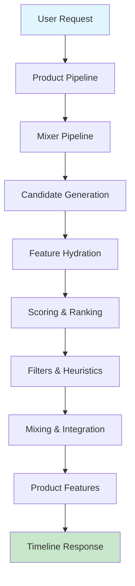

## System Architecture

### High-Level Architecture

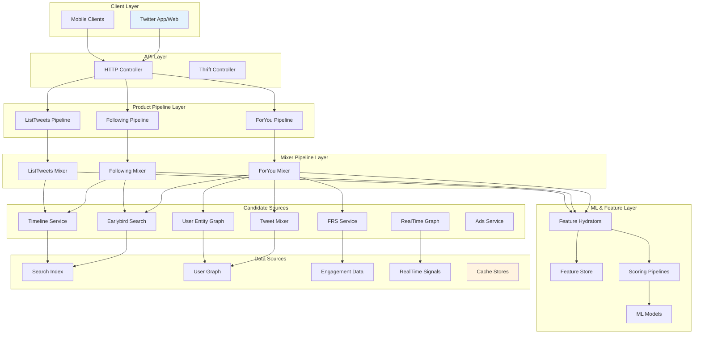

### Product Pipeline Hierarchy

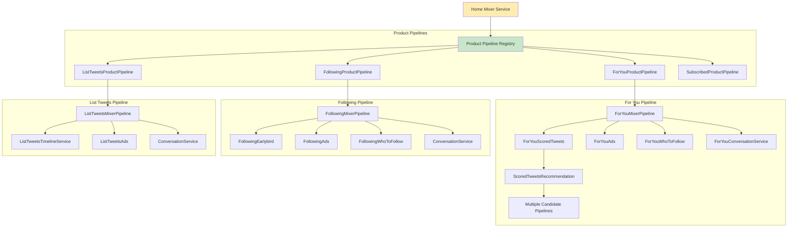

## Core Data Flow

### For You Timeline Data Flow

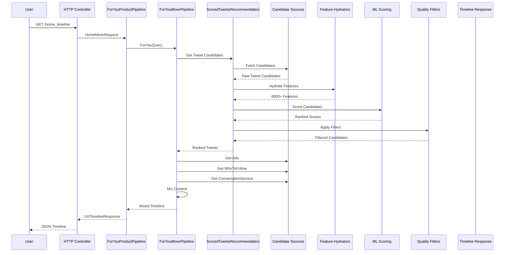

### Feature Hydration Process

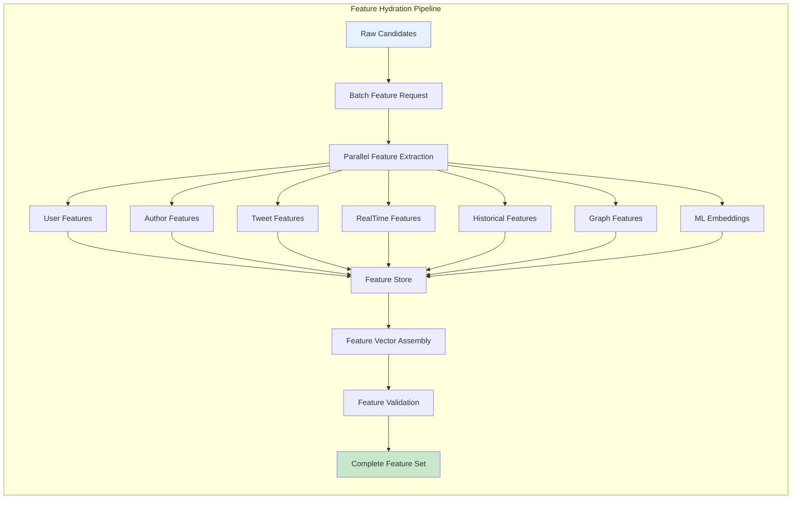

## Component Interactions

### Candidate Pipeline Architecture

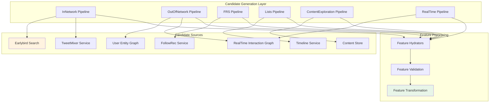

### Real-time Signal Processing

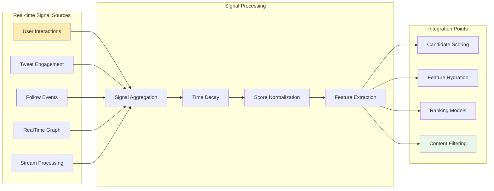

## Scoring and Ranking

### Multi-Stage Scoring Pipeline

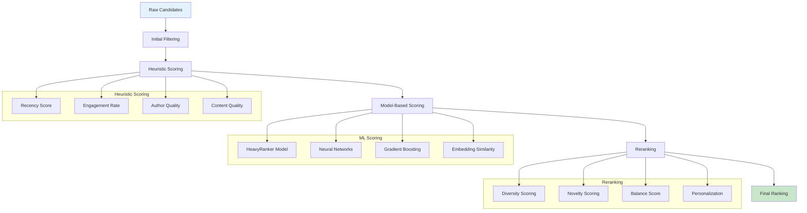

### Feature Categories and Scoring

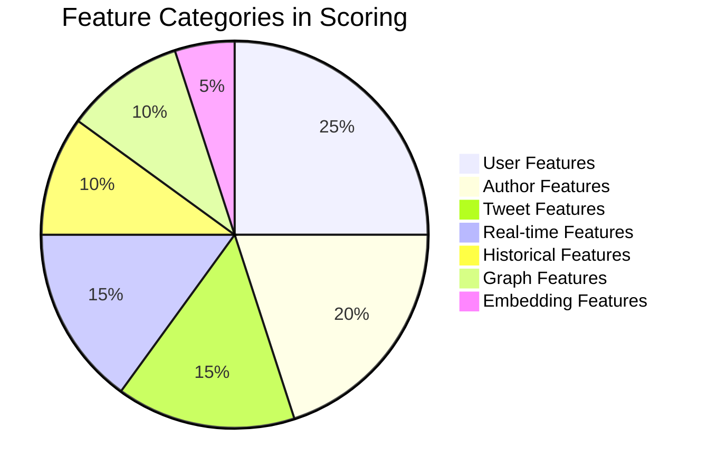

### Scoring Model Architecture

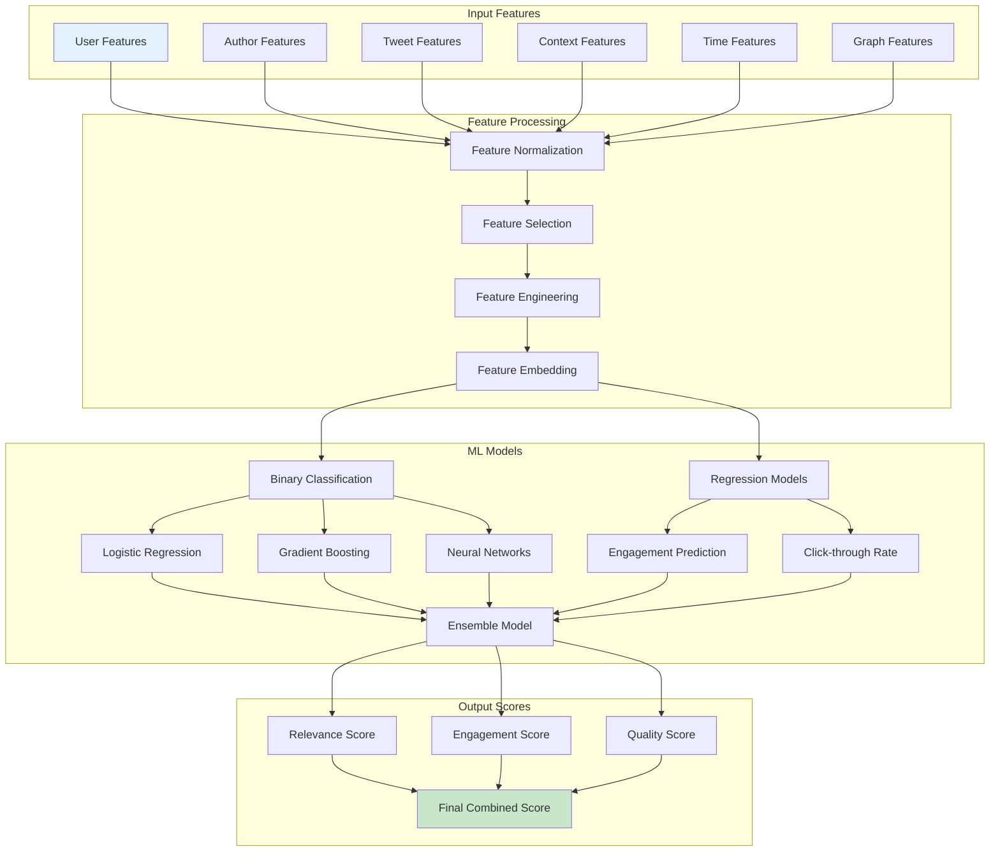

## Real-time Processing

### Real-time Data Integration

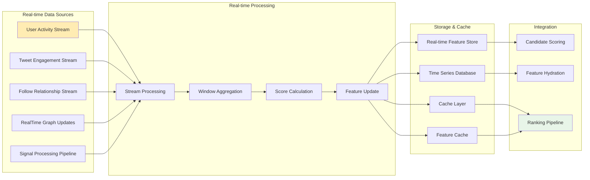

### Real-time Feature Processing Pipeline

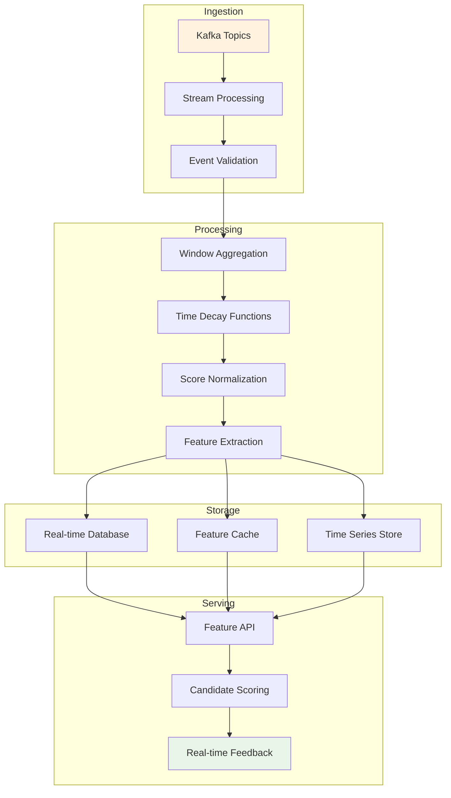

## Machine Learning Integration

### ML Model Pipeline Architecture

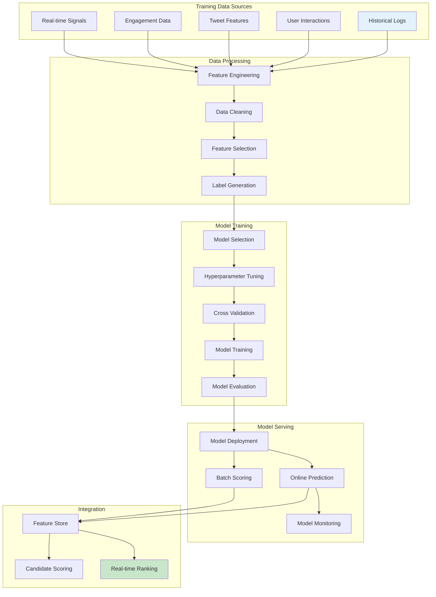

### Feature Store Integration

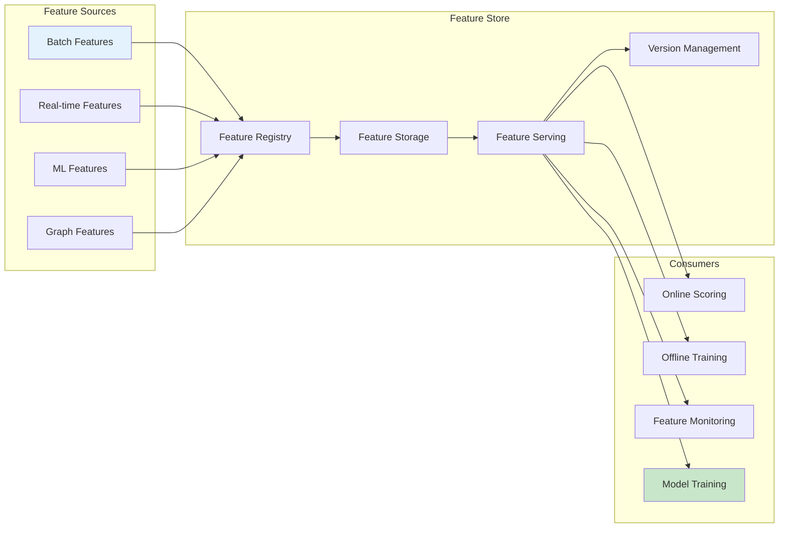

### Model Ensemble Architecture

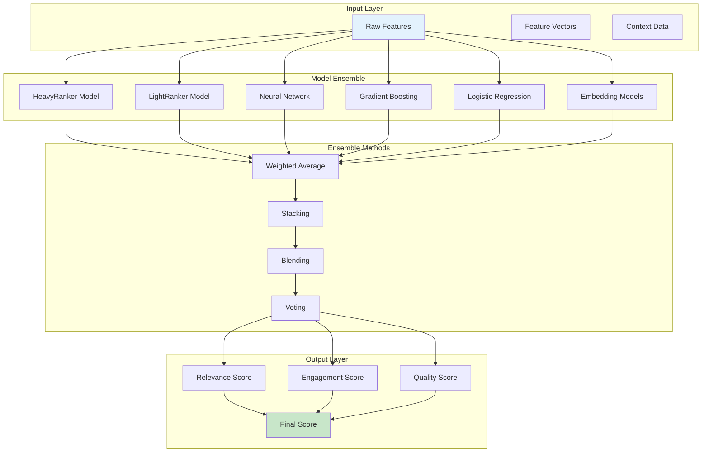

This documentation provides a comprehensive overview of the Twitter Home Mixer algorithm architecture, highlighting the complex interplay between various components, real-time processing capabilities, and sophisticated machine learning integration that powers Twitter's home timeline recommendations.