# Twitter Home Mixer Component Interactions

## Table of Contents
- [Pipeline Architecture](#pipeline-architecture)
- [Candidate Sources](#candidate-sources)
- [Feature Hydration](#feature-hydration)
- [Scoring Pipelines](#scoring-pipelines)
- [Filtering and Quality Control](#filtering-and-quality-control)
- [Content Mixing](#content-mixing)
- [Response Generation](#response-generation)

## Pipeline Architecture

### Overall Pipeline Flow

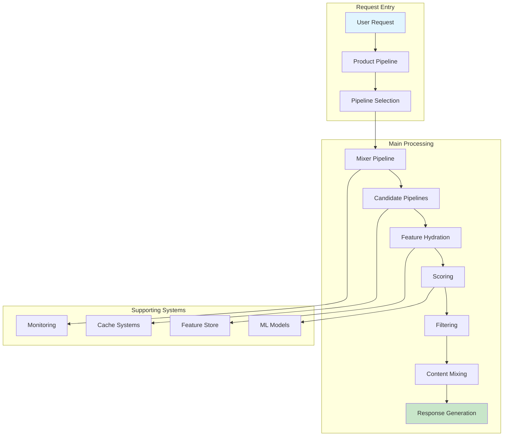

### Product Pipeline Details

```mermaid
graph TB
    subgraph "ForYouProductPipeline"
        A[ForYouProductPipelineConfig]
        A --> B[ForYouMixerPipelineConfig]

        B --> C[ForYouScoredTweetsCandidatePipeline]
        B --> D[ForYouAdsCandidatePipeline]
        B --> E[ForYouWhoToFollowCandidatePipeline]
        B --> F[ForYouConversationServiceCandidatePipeline]

        C --> G[ScoredTweetsRecommendationPipelineConfig]
        G --> H[Multiple Candidate Sources]
        G --> I[Feature Hydration]
        G --> J[Scoring Pipelines]
    end

    subgraph "FollowingProductPipeline"
        K[FollowingProductPipelineConfig]
        K --> L[FollowingMixerPipelineConfig]

        L --> M[FollowingEarlybirdCandidatePipeline]
        L --> N[FollowingAdsCandidatePipeline]
        L --> O[FollowingWhoToFollowCandidatePipeline]
        L --> P[ConversationServiceCandidatePipeline]
    end

    subgraph "ListTweetsProductPipeline"
        Q[ListTweetsProductPipelineConfig]
        Q --> R[ListTweetsMixerPipelineConfig]

        R --> S[ListTweetsTimelineServiceCandidatePipeline]
        R --> T[ListTweetsAdsCandidatePipeline]
        R --> U[ConversationServiceCandidatePipeline]
    end

    style A fill:#ffecb3
    style Q fill:#fff3e0
    style G fill:#e8f5e8
```

## Candidate Sources

### Candidate Source Architecture

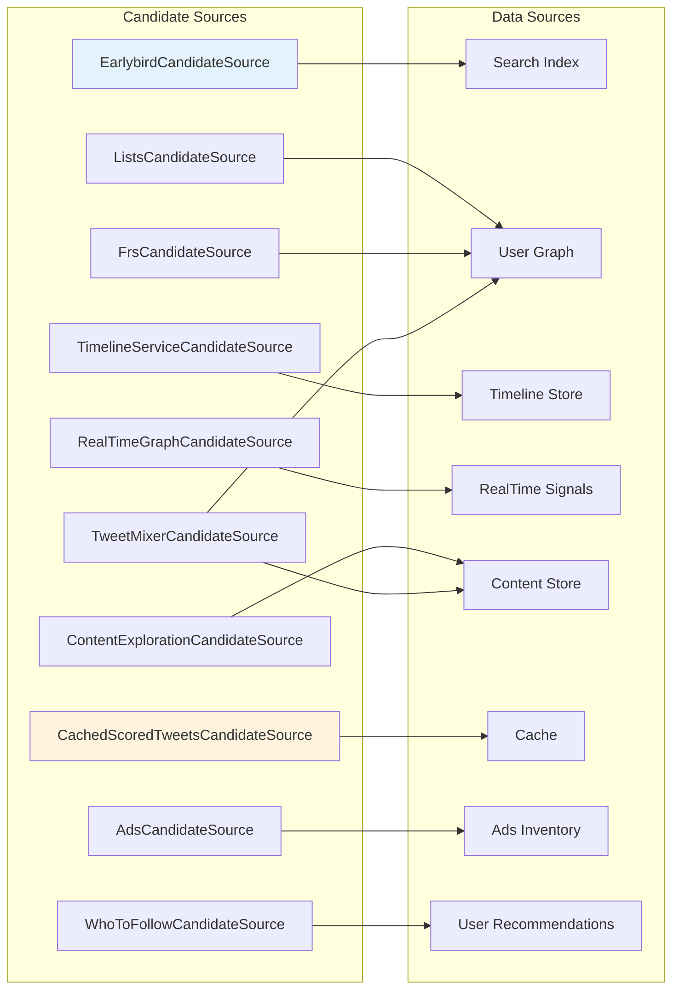

### ScoredTweets Candidate Pipelines

```mermaid
graph TD
    subgraph "InNetwork Sources"
        A[ScoredTweetsInNetworkCandidatePipeline]
        A --> A1[Earlybird Search]
        A --> A2[User Timeline]
        A --> A3[Follow Network]
    end

    subgraph "OutOfNetwork Sources"
        B[ScoredTweetsUtegCandidatePipeline]
        B --> B1[UserTweetEntityGraph]
        B --> B2[Topic Recommendations]
        B --> B3[Content Similarity]
    end

    subgraph "Social Graph Sources"
        C[ScoredTweetsFrsCandidatePipeline]
        C --> C1[FollowRecommendations]
        C --> C2[Similar Users]
        C --> C3[Social Graph]
    end

    subgraph "Content Sources"
        D[ScoredTweetsContentExplorationCandidatePipeline]
        D --> D1[Trending Topics]
        D --> D2[Popular Content]
        D --> D3[Discovery]
    end

    subgraph "List Sources"
        E[ScoredTweetsListsCandidatePipeline]
        E --> E1[User Lists]
        E --> E2[Curated Content]
        E --> E3[List Members]
    end

    subgraph "Video Sources"
        F[ScoredTweetsPopularVideosCandidatePipeline]
        F --> F1[Video Content]
        F --> F2[Video Engagement]
        F --> F3[Video Trends]
    end

    subgraph "Cache Sources"
        G[CachedScoredTweetsCandidatePipeline]
        G --> G1[Pre-computed Results]
        G --> G2[Cache Store]
        G --> G3[Fast Lookup]
    end

    style A fill:#e1f5fe
    style G fill:#fff3e0
```

## Feature Hydration

### Feature Hydration Process

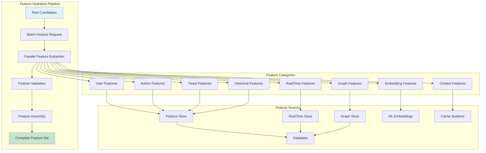

### Key Feature Hydrators

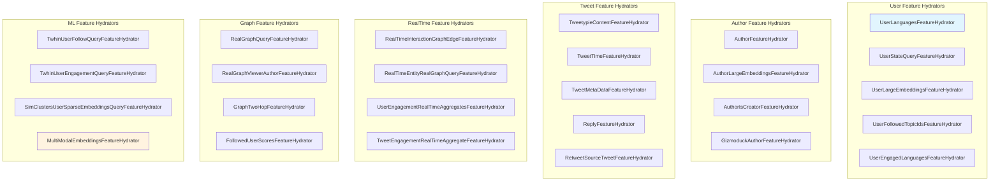

### RealTime Aggregate Features

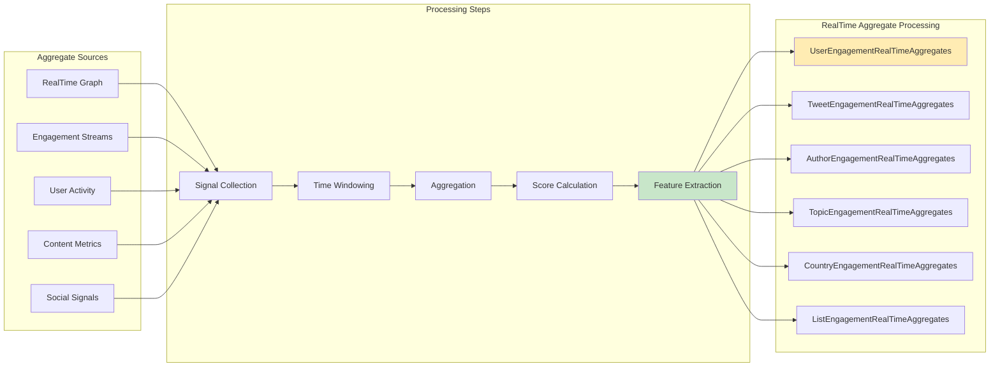

## Scoring Pipelines

### Multi-Stage Scoring Architecture

```mermaid
graph TD
    subgraph "Scoring Pipeline Stages"
        A[HeuristicScoringPipeline]
        B[LowSignalScoringPipeline]
        C[ModelScoringPipeline]
        D[RerankingScoringPipeline]
    end

    subgraph "Heuristic Scoring"
        E[Recency Score]
        F[Engagement Rate]
        G[Author Quality]
        H[Content Quality]
        I[Social Proof]
    end

    subgraph "Low Signal Scoring"
        J[Basic Features]
        K[Simple Models]
        L[Fallback Logic]
        M[Threshold Filtering]
    end

    subgraph "Model Scoring"
        N[HeavyRanker Model]
        O[Neural Networks]
        P[Gradient Boosting]
        Q[Ensemble Methods]
        R[Embedding Similarity]
    end

    subgraph "Reranking"
        S[Diversity Scoring]
        T[Novelty Penalty]
        U[Balance Optimization]
        V[Personalization Boost]
        W[RealTime Adjustment]
    end

    A --> E
    A --> F
    A --> G
    A --> H
    A --> I

    B --> J
    B --> K
    B --> L
    B --> M

    C --> N
    C --> O
    C --> P
    C --> Q
    C --> R

    D --> S
    D --> T
    D --> U
    D --> V
    D --> W

    style A fill:#e1f5fe
    style D fill:#c8e6c9
```

### Scoring Model Integration

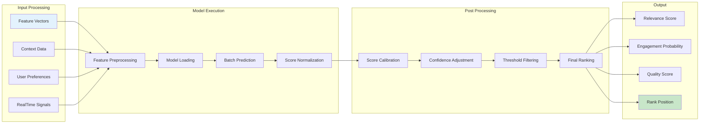

## Filtering and Quality Control

### Filter Pipeline Architecture

```mermaid
graph TD
    subgraph "Pre-Scoring Filters"
        A[HasAuthorFilter]
        B[LocationFilter]
        C[MinVideoDurationFilter]
        D[InvalidSubscriptionTweetFilter]
        E[TweetHydrationFilter]
    end

    subgraph "Post-Scoring Filters"
        F[FeedbackFatigueFilter]
        G[PreviouslySeenTweetsFilter]
        H[PreviouslyServedTweetsFilter]
        I[RetweetDeduplicationFilter]
        J[QuoteDeduplicationFilter]
        K[MediaIdDeduplicationFilter]
        L[ClipVideoClusterDeduplicationFilter]
        M[ClipImageClusterDeduplicationFilter]
        N[SlopFilter]
        O[RejectTweetFromViewerFilter]
    end

    subgraph "Content Quality Filters"
        P[GrokSpamFilter]
        Q[GrokNsfwFilter]
        Q1[GrokGoreFilter]
        Q2[GrokViolentFilter]
        R[ControlAiFilter]
    end

    subgraph "Filter Orchestration"
        S[Filter Chain]
        T[Parallel Execution]
        U[Result Aggregation]
        V[Final Filtering]
    end

    A --> S
    B --> S
    C --> S
    D --> S
    E --> S

    F --> T
    G --> T
    H --> T
    I --> T
    J --> T
    K --> T
    L --> T
    M --> T
    N --> T
    O --> T

    P --> U
    Q --> U
    Q1 --> U
    Q2 --> U
    R --> U

    S --> V
    T --> V
    U --> V

    style A fill:#e1f5fe
    style V fill:#c8e6c9
```

### Content Safety and Moderation

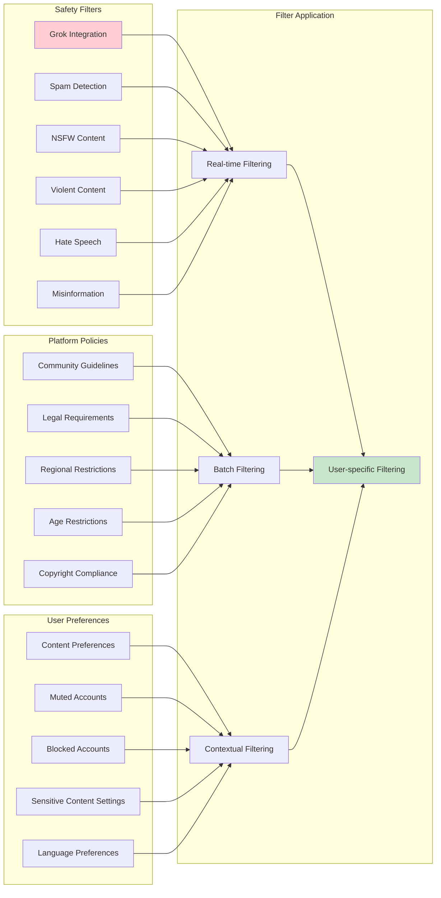

## Content Mixing

### Content Mixing Architecture

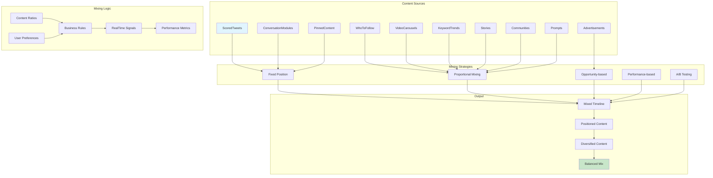

### Content Balance and Diversity

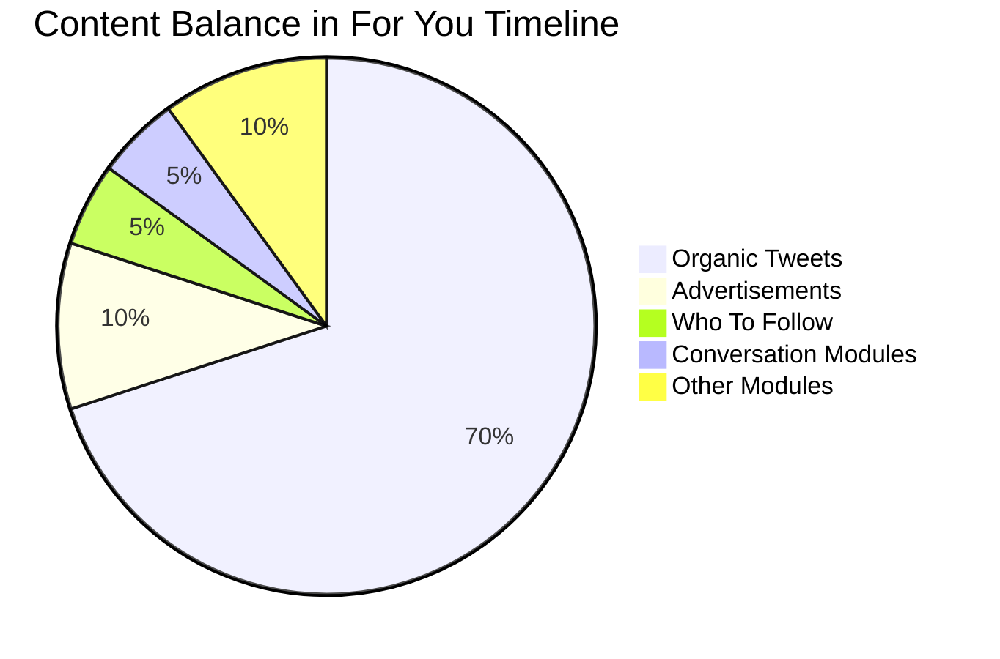

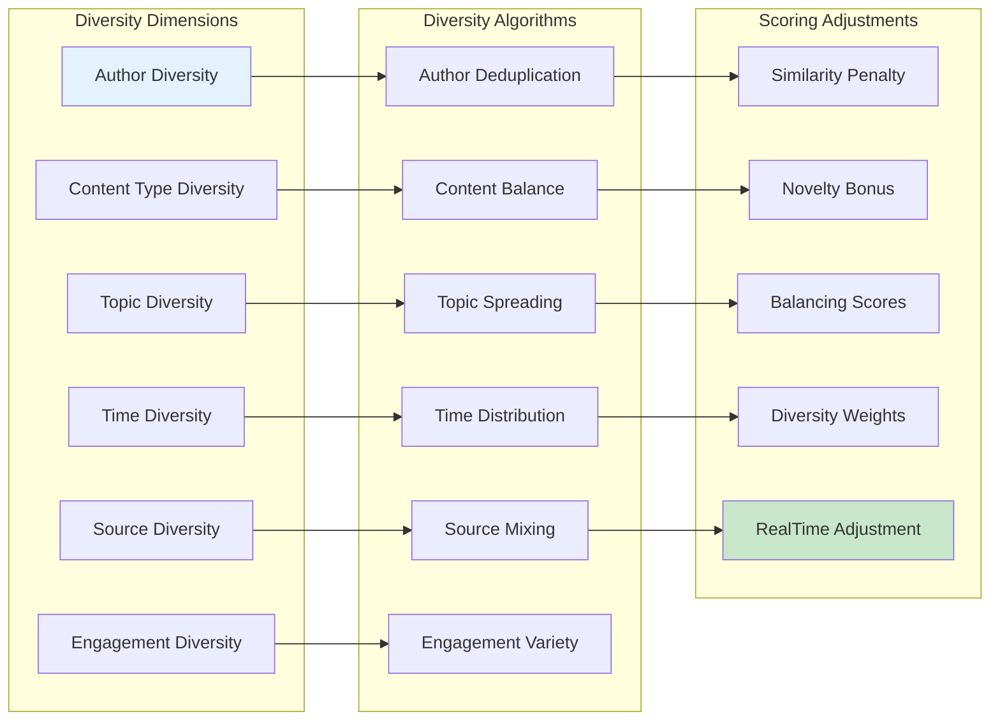

## Response Generation

### Timeline Response Generation

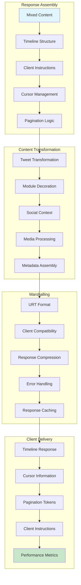

### Client Instructions and Features

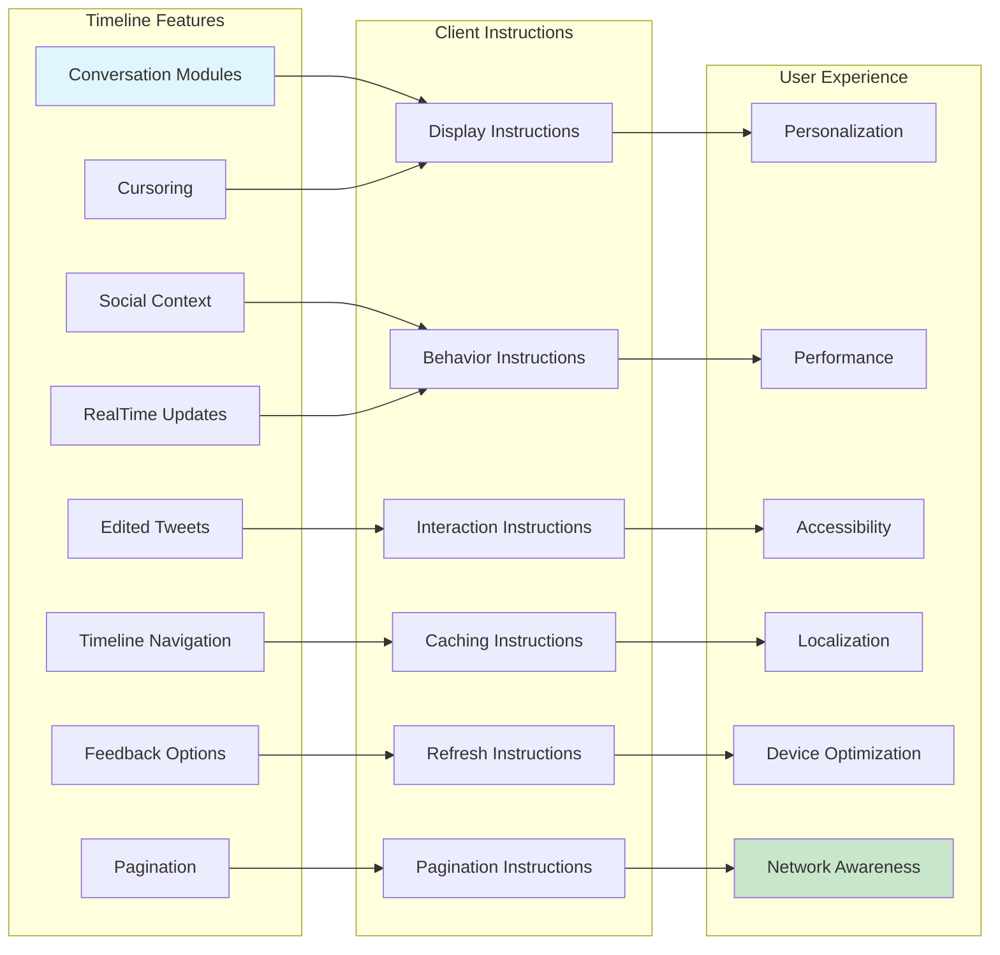

This documentation provides a detailed view of how components interact within the Twitter Home Mixer system, from candidate generation through feature hydration, scoring, filtering, content mixing, and final response generation.