# Twitter Home Mixer Scoring and Ranking Workflows

## Table of Contents
- [Scoring Architecture Overview](#scoring-architecture-overview)
- [Feature Engineering](#feature-engineering)
- [Machine Learning Models](#machine-learning-models)
- [Scoring Pipeline Stages](#scoring-pipeline-stages)
- [Ranking Algorithms](#ranking-algorithms)
- [Real-time Scoring](#real-time-scoring)
- [Quality Control](#quality-control)
- [Performance Optimization](#performance-optimization)

## Scoring Architecture Overview

### Multi-Layered Scoring System

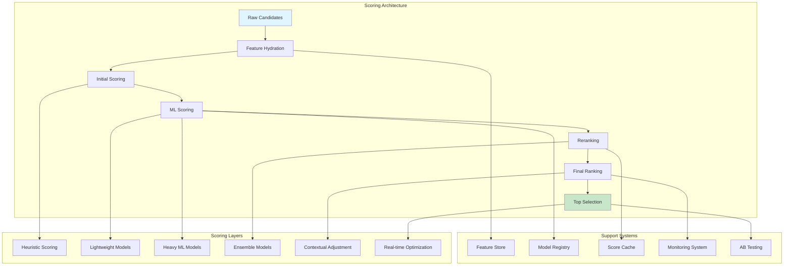

### Scoring Pipeline Flow

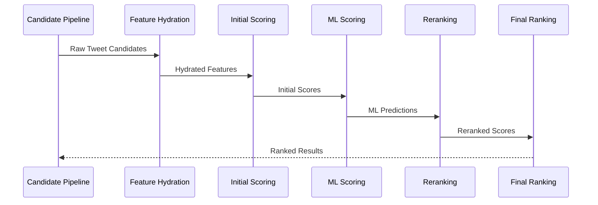

## Feature Engineering

### Feature Categories and Sources

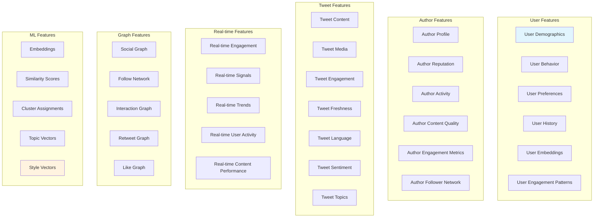

### Feature Processing Pipeline

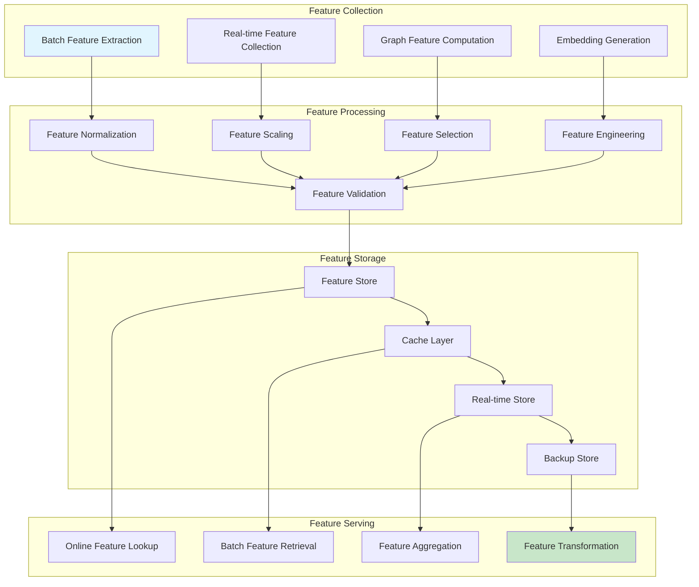

### Key Feature Metrics

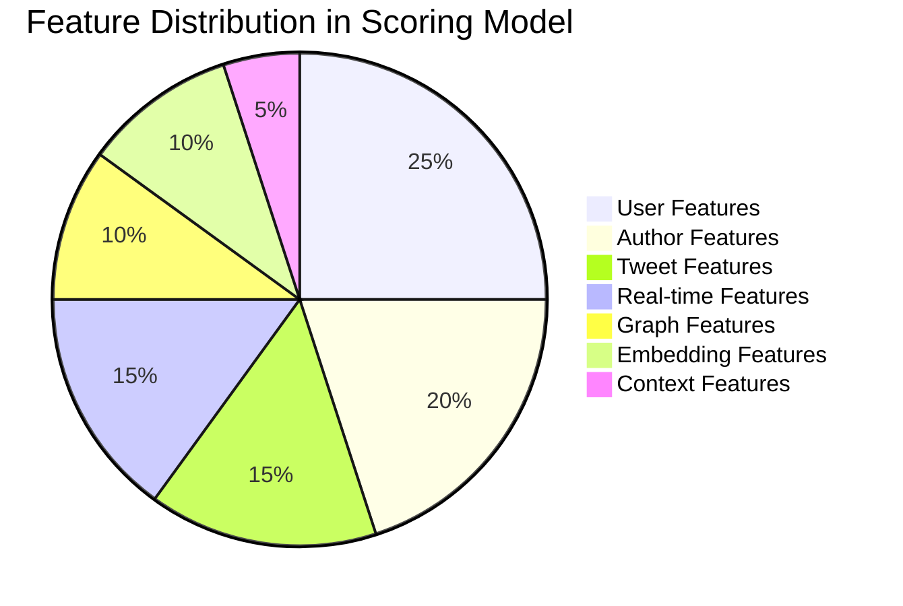

## Machine Learning Models

### Model Architecture

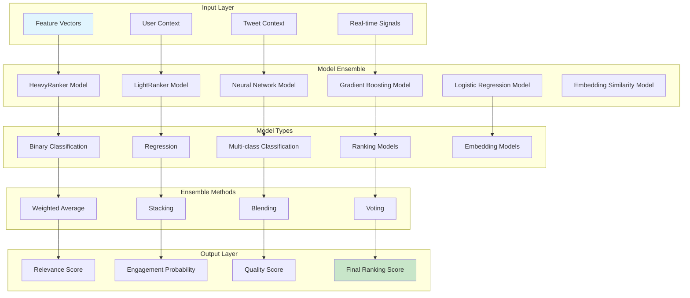

### HeavyRanker Model Architecture

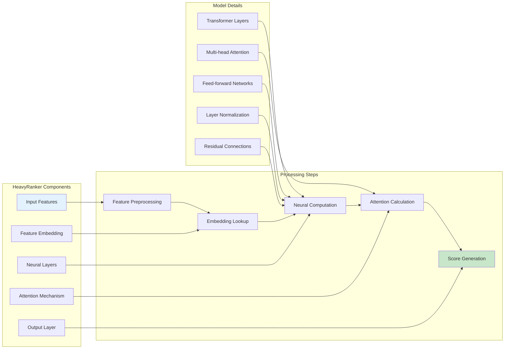

### Model Training Pipeline

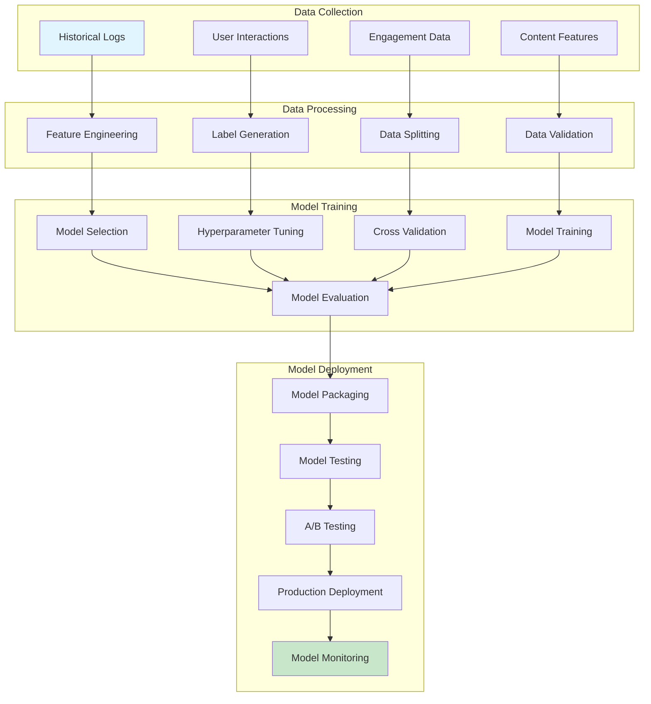

## Scoring Pipeline Stages

### Stage 1: Heuristic Scoring

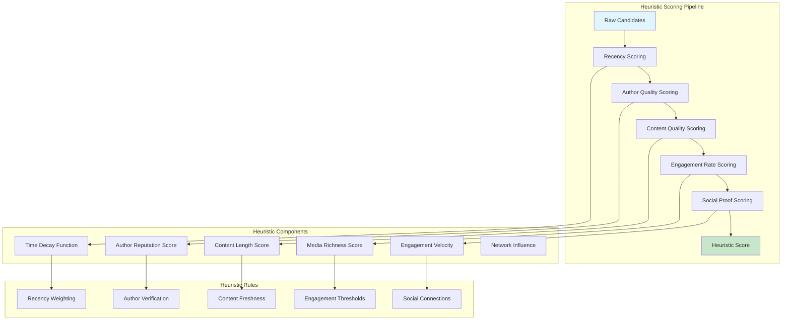

### Stage 2: ML Scoring

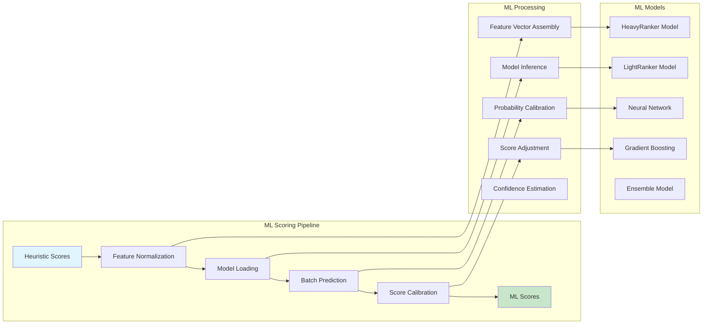

### Stage 3: Reranking

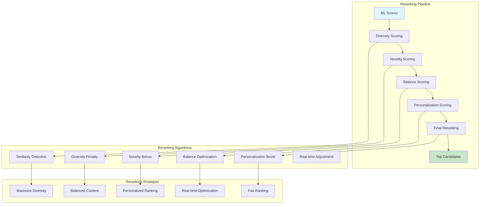

## Ranking Algorithms

### Ranking Strategy Overview

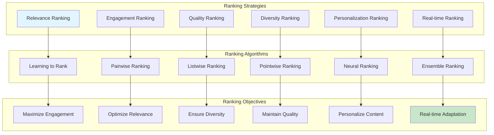

### Learning to Rank Architecture

```mermaid
graph LR
    subgraph "Learning to Rank"
        A[Training Data]
        B[Feature Vectors]
        C[Rank Labels]
        D[Model Training]
        E[Model Evaluation]
        F[Model Deployment]
    end

    subgraph "Ranking Methods"
        G[RankSVM]
        H[LambdaMART]
        I[DeepFM]
        J[Transformer]
        K[BERT]
        L[XGBoost]
    end

    subgraph "Ranking Metrics"
        M[NDCG]
        N[MAP]
        O[Precision@K]
        Q[Recall@K]
        R[MRR]
    end

    A --> D
    B --> D
    C --> D
    D --> E
    E --> F

    D --> G
    D --> H
    D --> I
    D --> J

    E --> M
    E --> N
    E --> O
    E --> Q
    E --> R

    style A fill:#e1f5fe
    style R fill:#c8e6c9
```

### Personalization Ranking

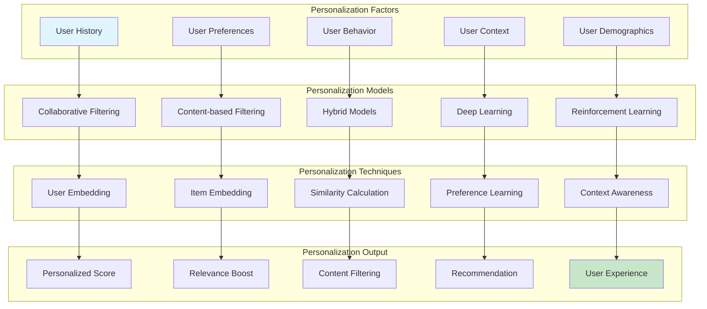

## Real-time Scoring

### Real-time Scoring Architecture

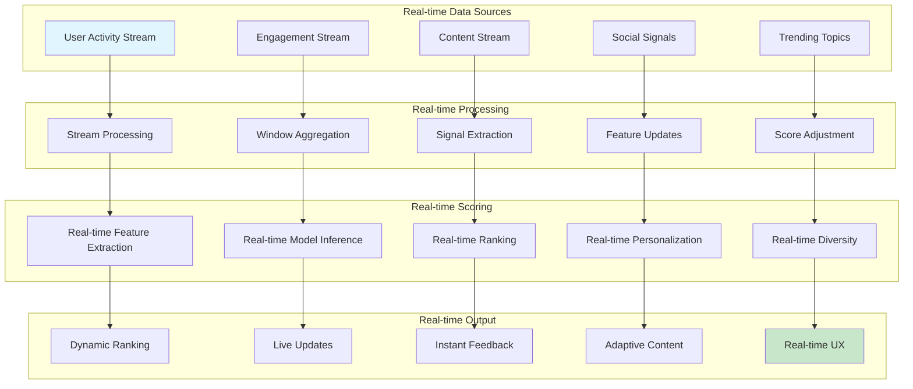

### Real-time Feature Processing

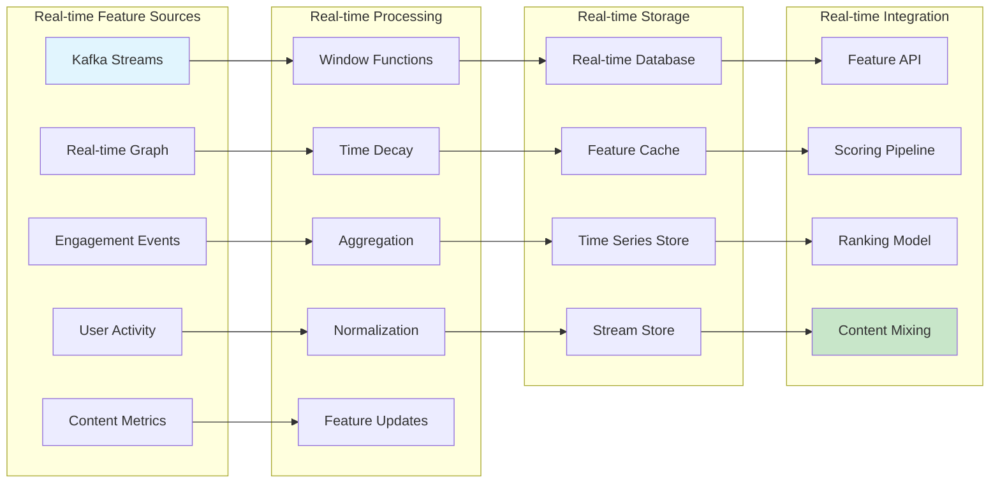

## Quality Control

### Quality Assurance Pipeline

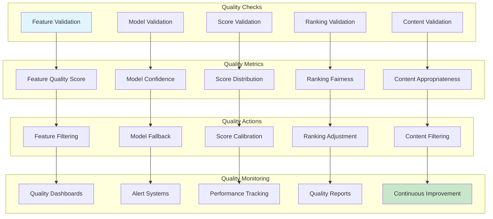

### Fairness and Bias Detection

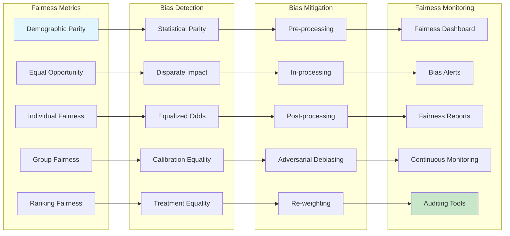

## Performance Optimization

### Performance Optimization Strategies

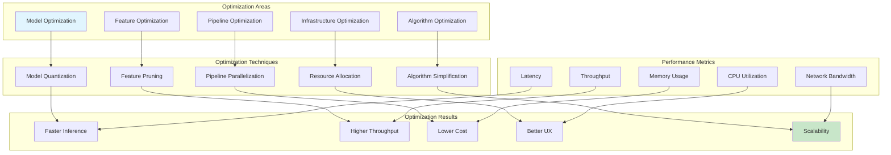

### Caching Strategy

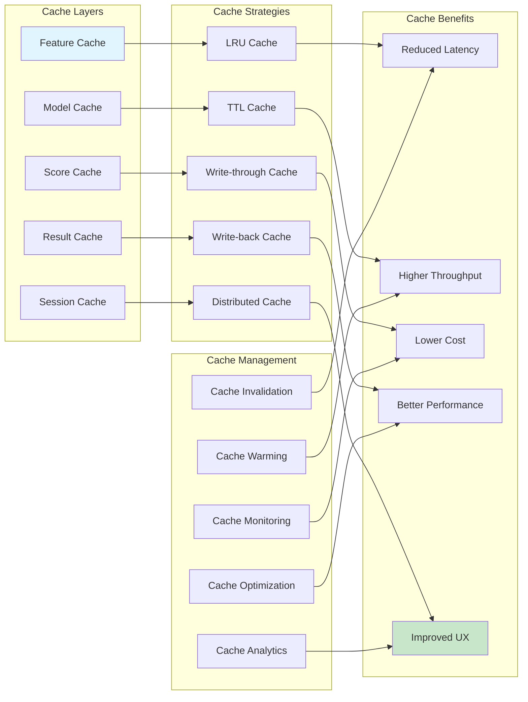

This documentation provides a comprehensive overview of the Twitter Home Mixer scoring and ranking workflows, covering everything from feature engineering and machine learning models to real-time processing and performance optimization.