# Twitter Home Mixer Real-time Processing Architecture

## Table of Contents
- [Real-time Overview](#real-time-overview)
- [Stream Processing Architecture](#stream-processing-architecture)
- [Real-time Data Sources](#real-time-data-sources)
- [Signal Processing](#signal-processing)
- [Real-time Feature Engineering](#real-time-feature-engineering)
- [Real-time Scoring](#real-time-scoring)
- [Real-time Adaptation](#real-time-adaptation)
- [Performance and Scalability](#performance-and-scalability)

## Real-time Overview

### Real-time Processing Philosophy

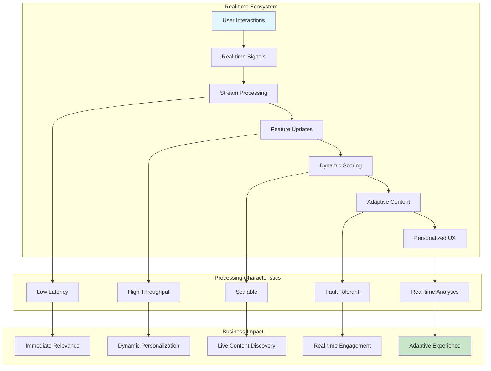

### Real-time Processing Timeline

```mermaid
gantt
    title Real-time Processing Timeline
    dateFormat  sss
    axisFormat %S.%L

    section User Interaction
    User Action       :a1, 0, 100ms
    Signal Generation  :a2, after a1, 50ms

    section Stream Processing
    Event Ingestion   :b1, after a2, 10ms
    Stream Processing :b2, after b1, 20ms
    Feature Extraction :b3, after b2, 30ms

    section Feature Updates
    Feature Storage   :c1, after b3, 5ms
    Feature Cache     :c2, after c1, 5ms
    Score Update      :c3, after c2, 10ms

    section Content Adaptation
    Ranking Update    :d1, after c3, 15ms
    Content Selection :d2, after d1, 20ms
    User Experience  :d3, after d2, 50ms
```

## Stream Processing Architecture

### Overall Stream Processing Flow

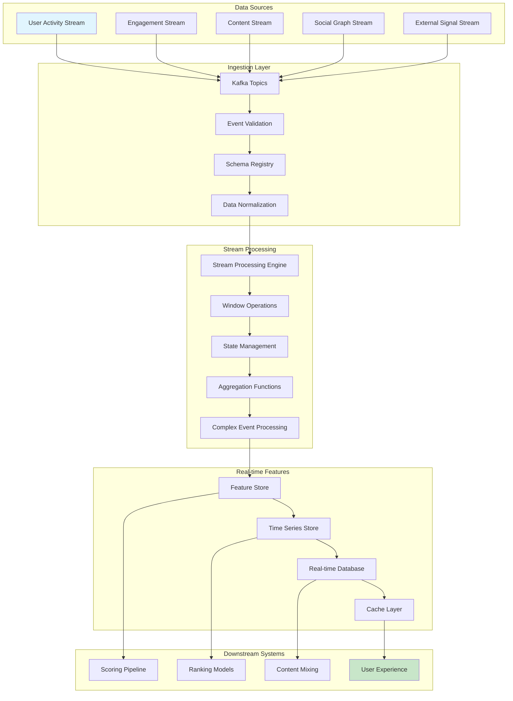

### Stream Processing Topology

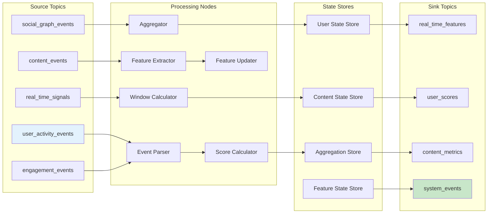

## Real-time Data Sources

### Real-time Signal Categories

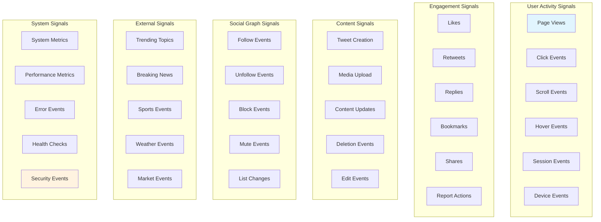

### Real-time Data Flow

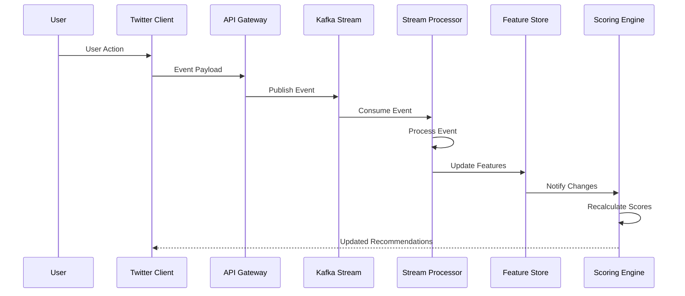

## Signal Processing

### Signal Processing Pipeline

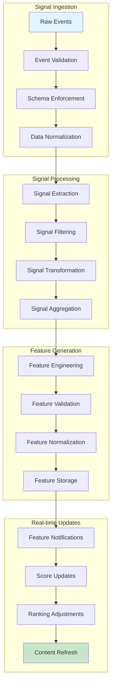

### Real-time Aggregation Strategies

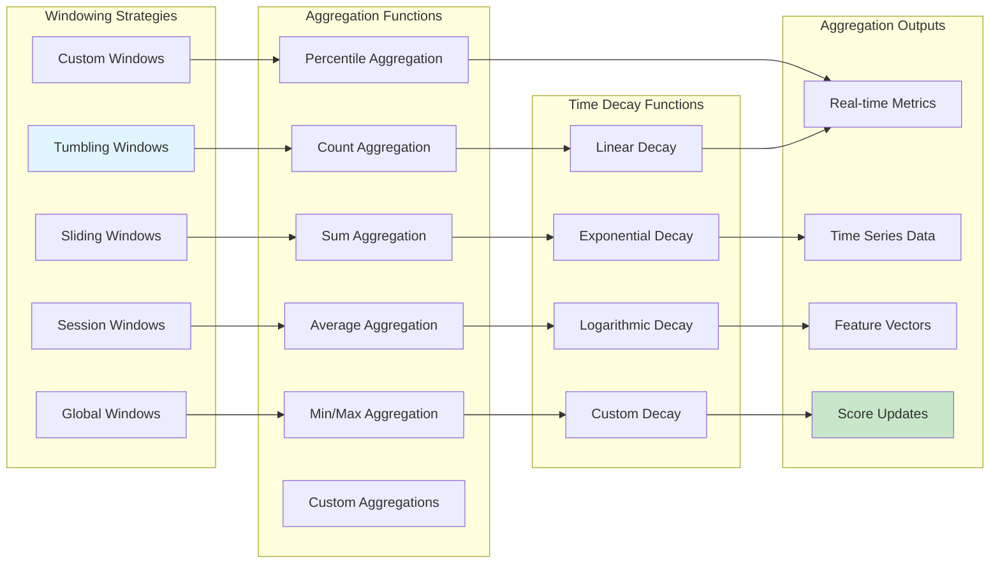

### Real-time Signal Quality

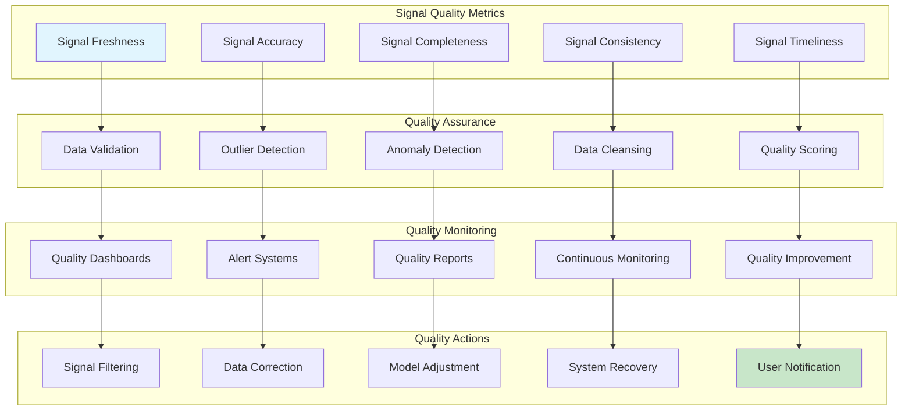

## Real-time Feature Engineering

### Real-time Feature Pipeline

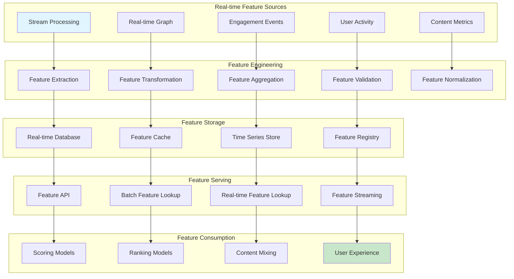

### Real-time Feature Categories

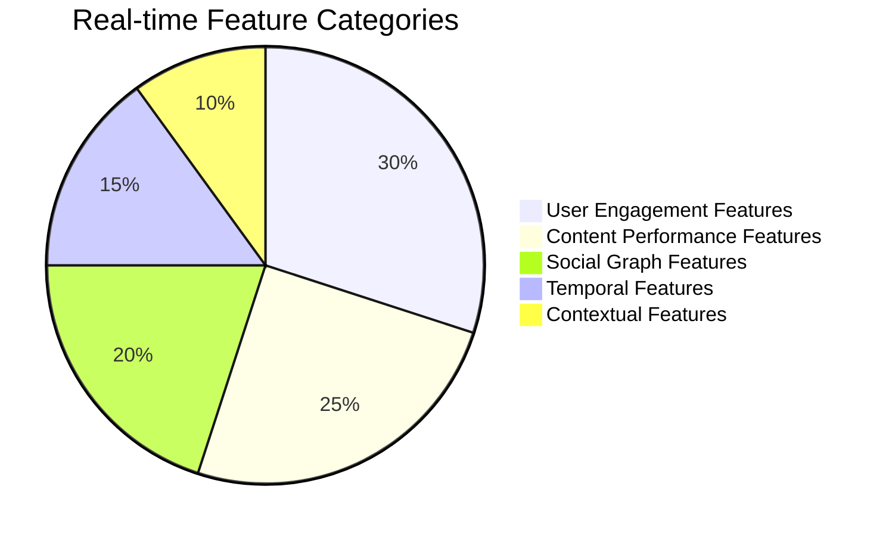

### Real-time Feature Update Patterns

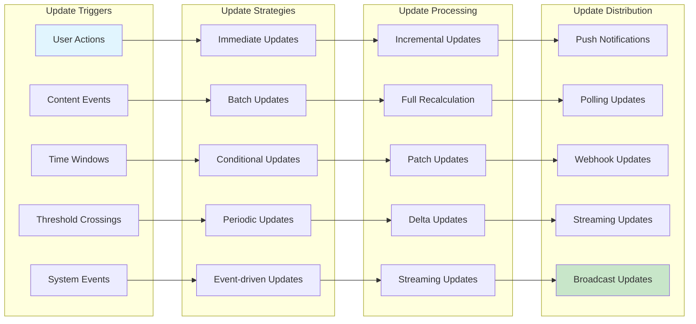

## Real-time Scoring

### Real-time Scoring Architecture

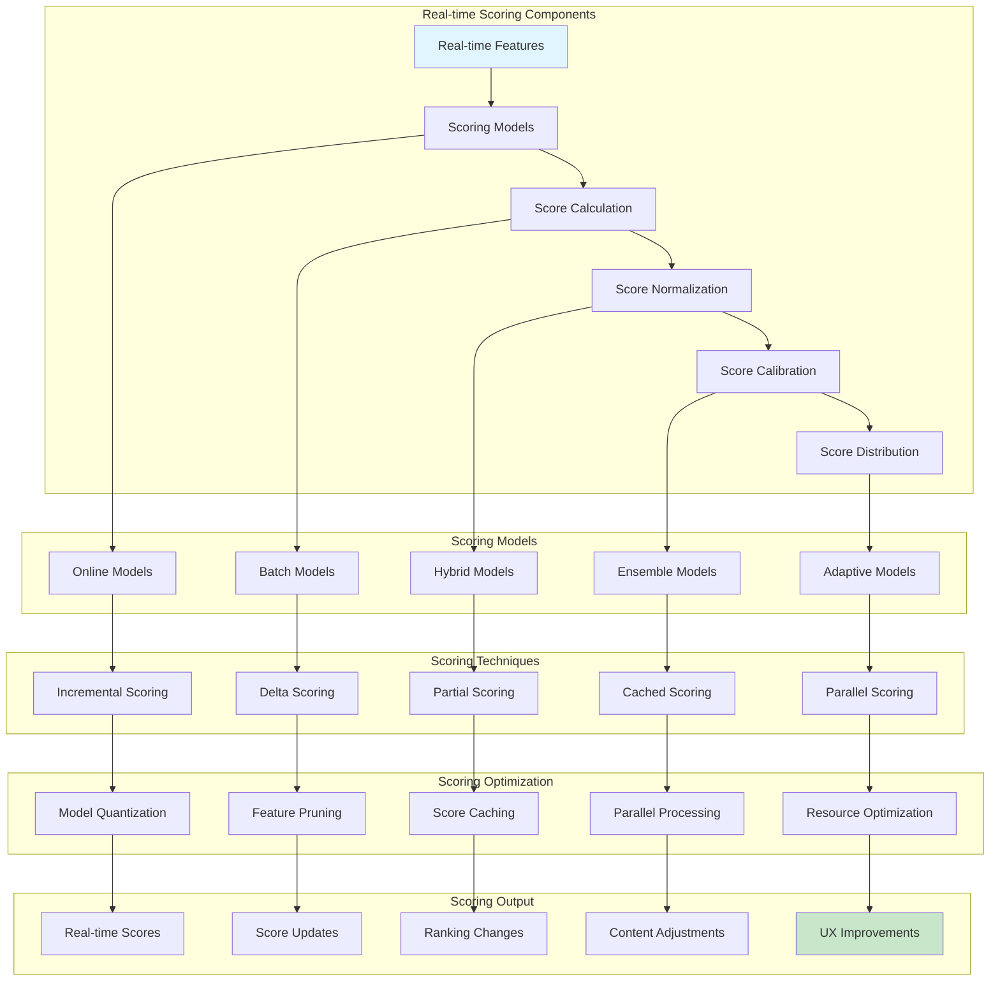

### Real-time Score Updates

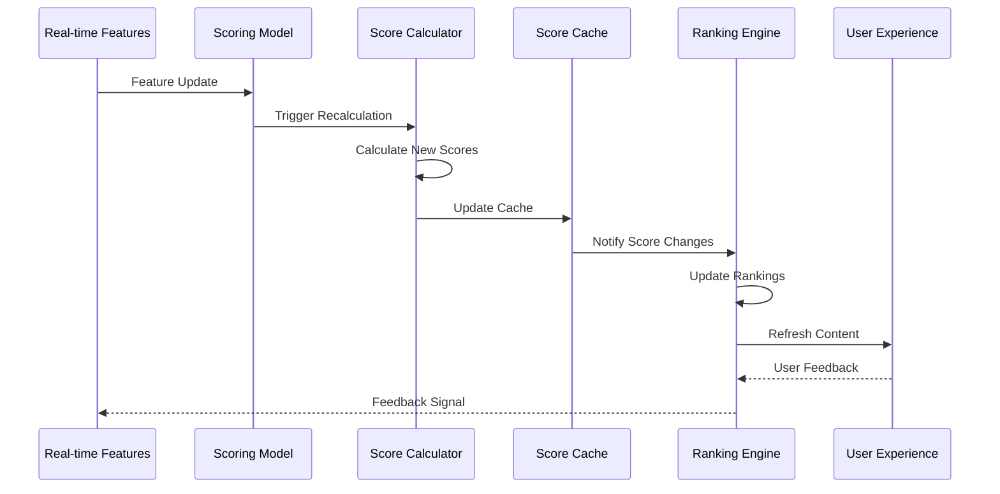

### Real-time Score Adaptation

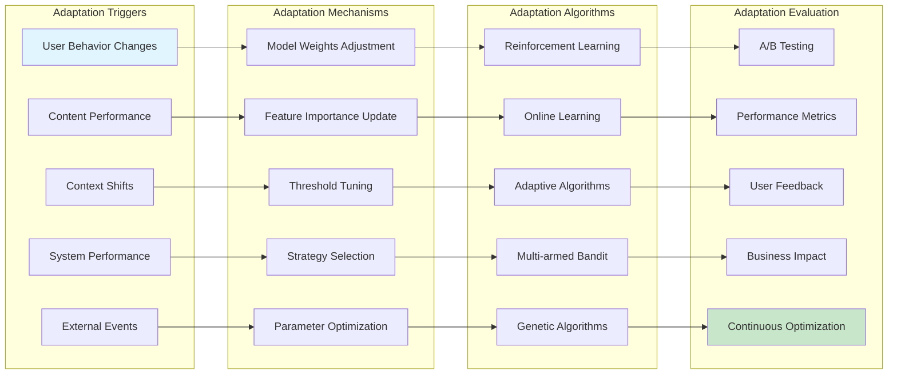

## Real-time Adaptation

### Adaptive Content Selection

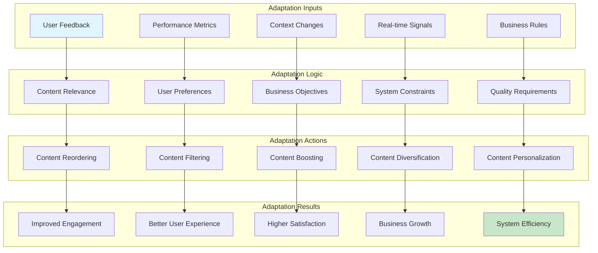

### Real-time Personalization

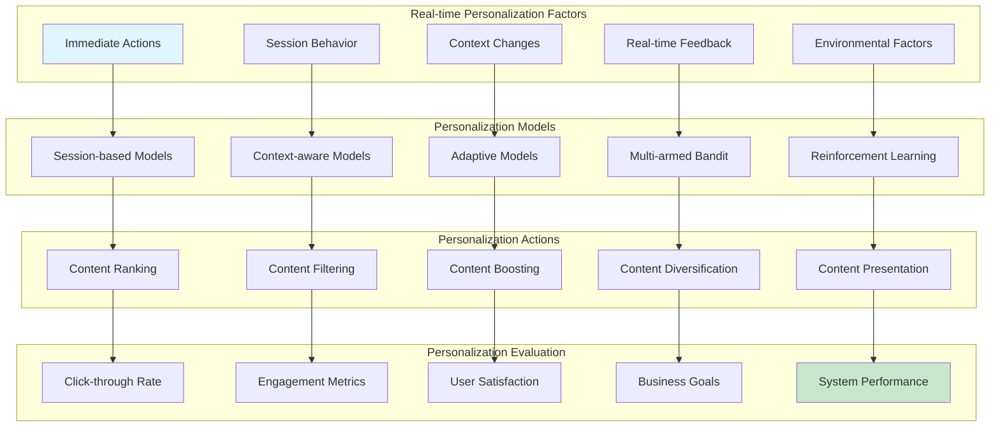

## Performance and Scalability

### Performance Optimization Strategies

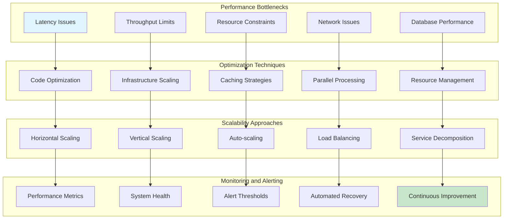

### Real-time System Scalability

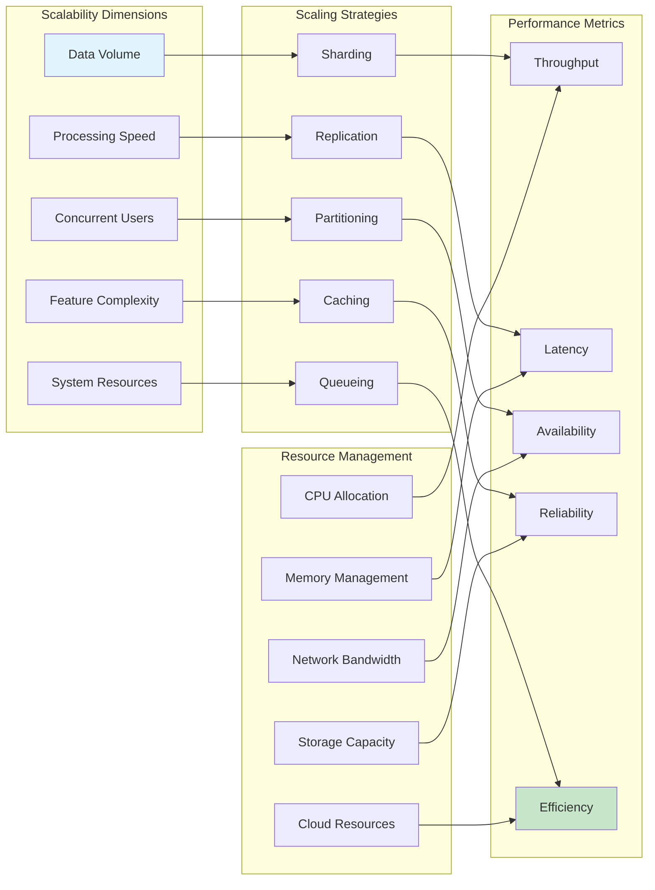

### Fault Tolerance and Reliability

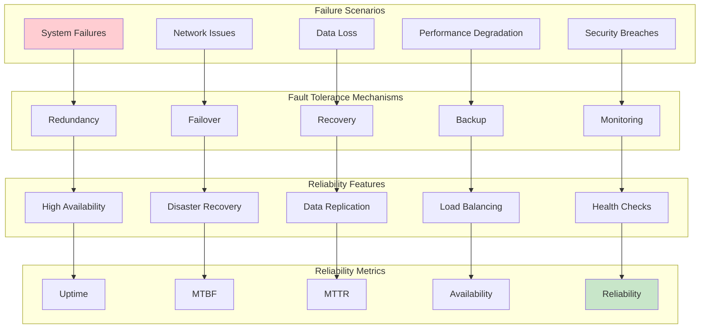

This documentation provides a comprehensive overview of the Twitter Home Mixer real-time processing architecture, covering everything from stream processing and signal handling to real-time feature engineering and adaptive content selection.