# Twitter Home Mixer Machine Learning Integration

## Table of Contents
- [ML Integration Overview](#ml-integration-overview)
- [ML Architecture](#ml-architecture)
- [Model Management](#model-management)
- [Feature Engineering](#feature-engineering)
- [Training Pipelines](#training-pipelines)
- [Model Serving](#model-serving)
- [ML Operations](#ml-operations)
- [Advanced ML Techniques](#advanced-ml-techniques)

## ML Integration Overview

### Machine Learning in Home Mixer

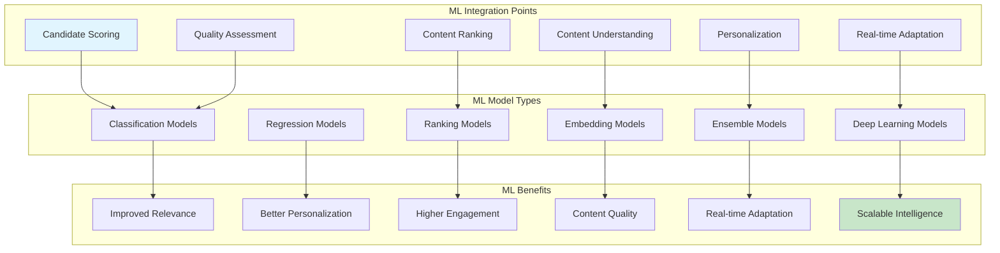

### ML System Architecture

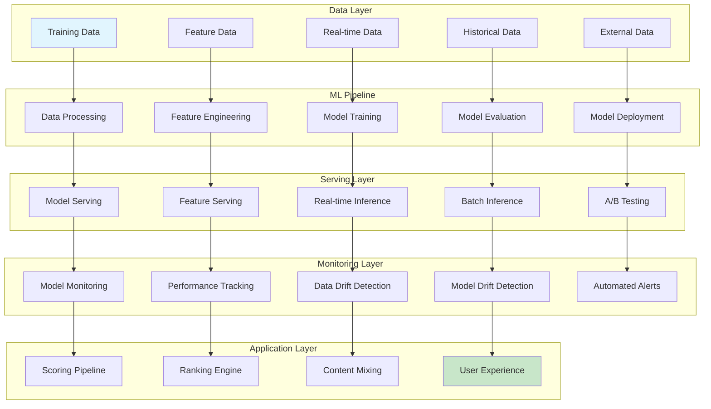

## ML Architecture

### Core ML Components

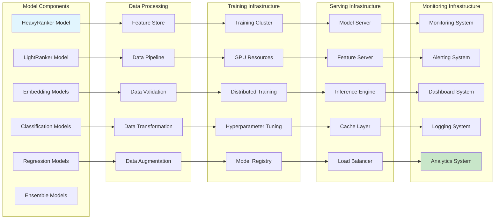

### HeavyRanker Model Architecture

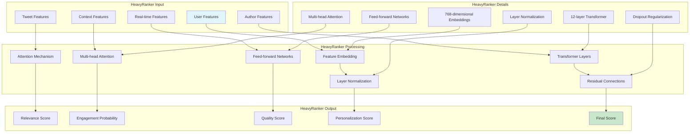

### Embedding Models Integration

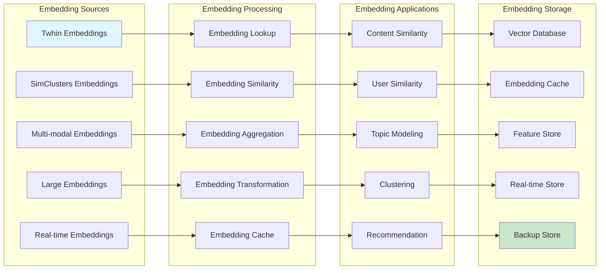

## Model Management

### Model Lifecycle Management

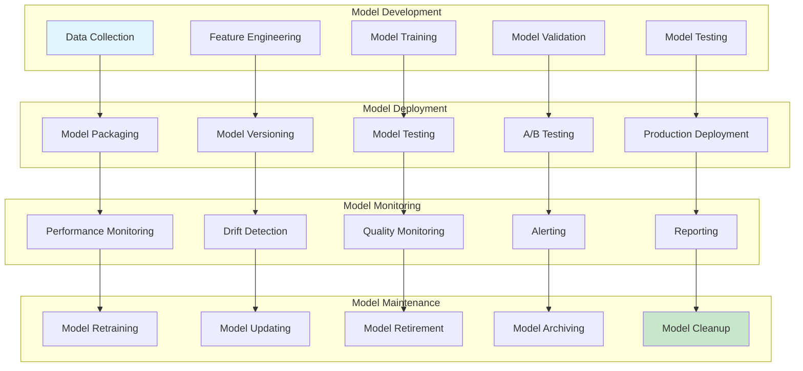

### Model Registry and Versioning

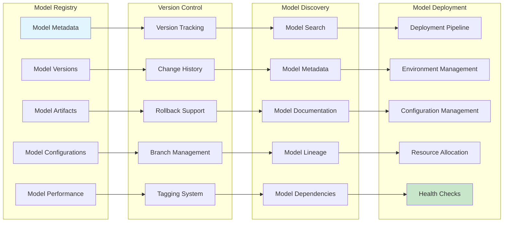

### A/B Testing Framework

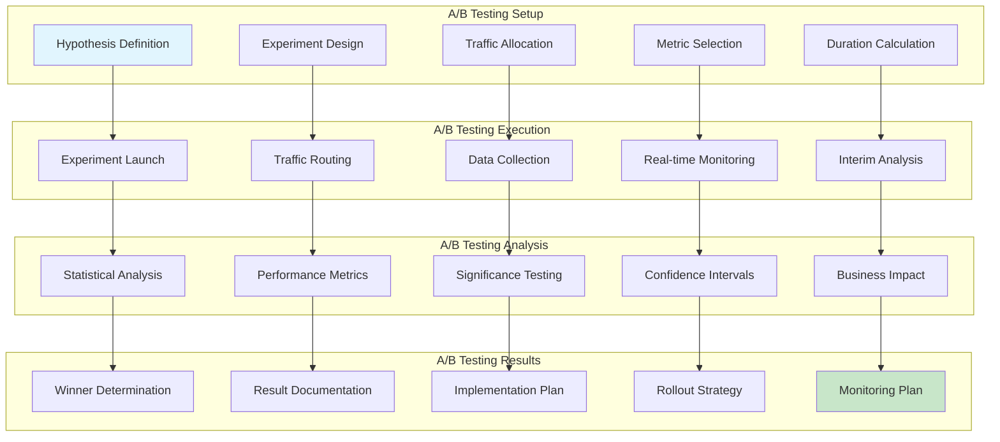

## Feature Engineering

### Feature Engineering Pipeline

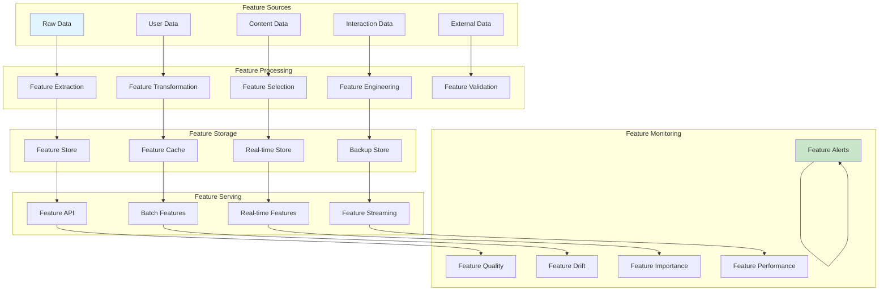

### Feature Categories and Types

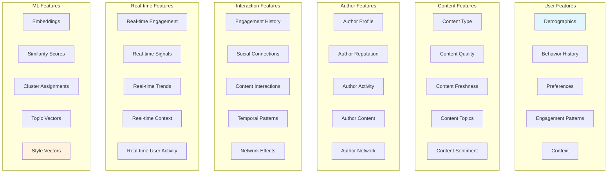

### Feature Store Architecture

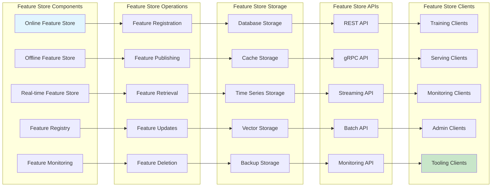

## Training Pipelines

### Training Pipeline Architecture

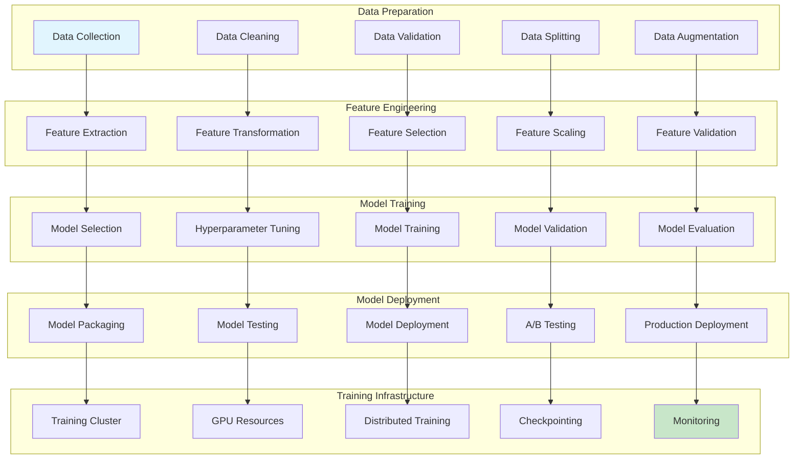

### Distributed Training Architecture

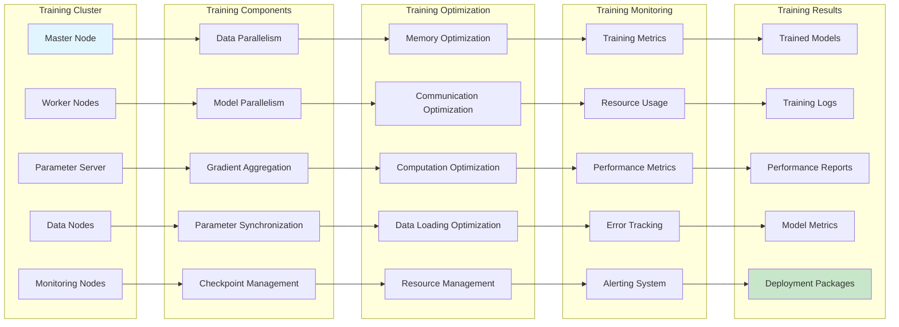

### Hyperparameter Optimization

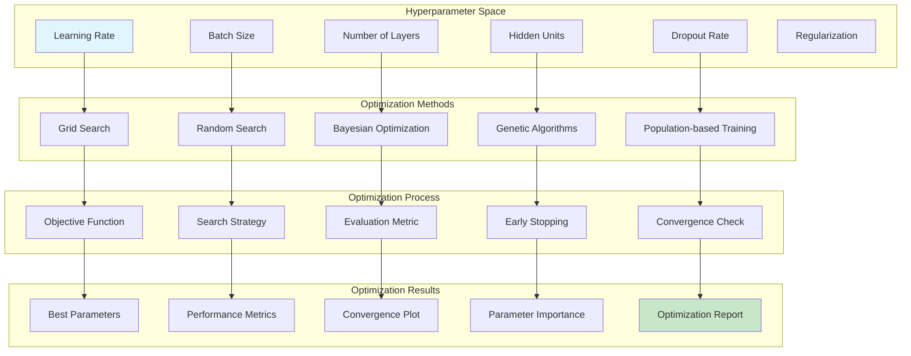

## Model Serving

### Model Serving Architecture

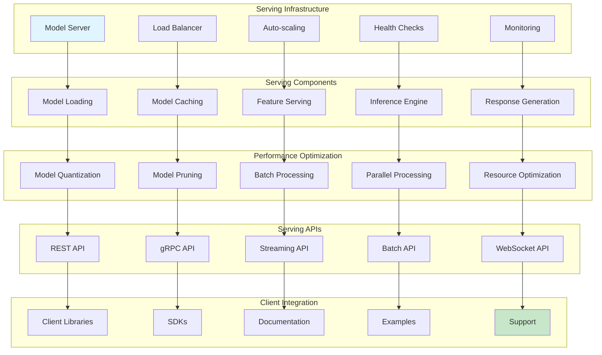

### Real-time Model Inference

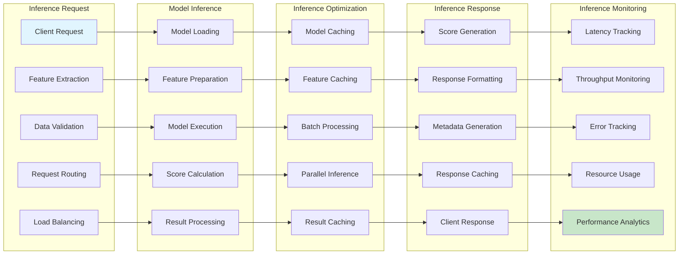

## ML Operations

### MLOps Architecture

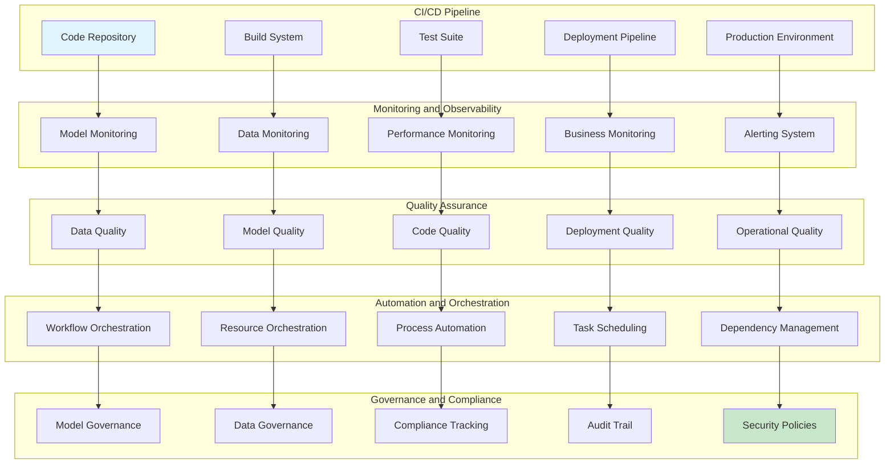

### Model Monitoring and Drift Detection

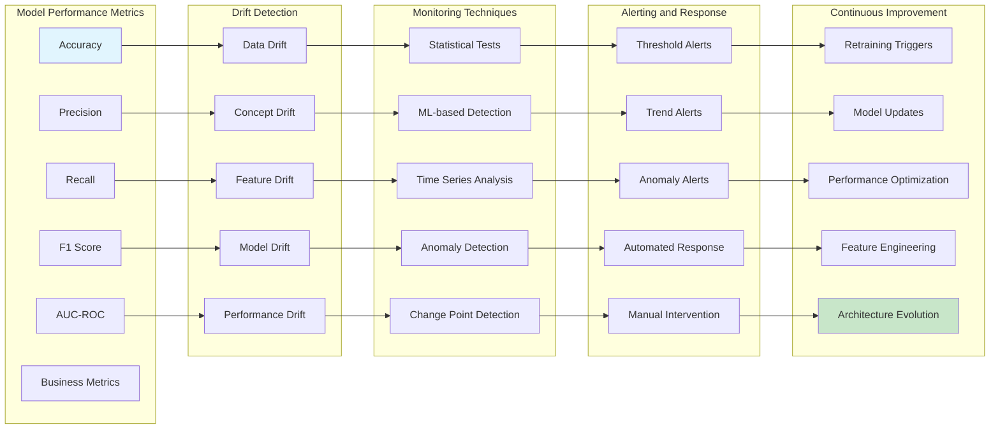

## Advanced ML Techniques

### Deep Learning Integration

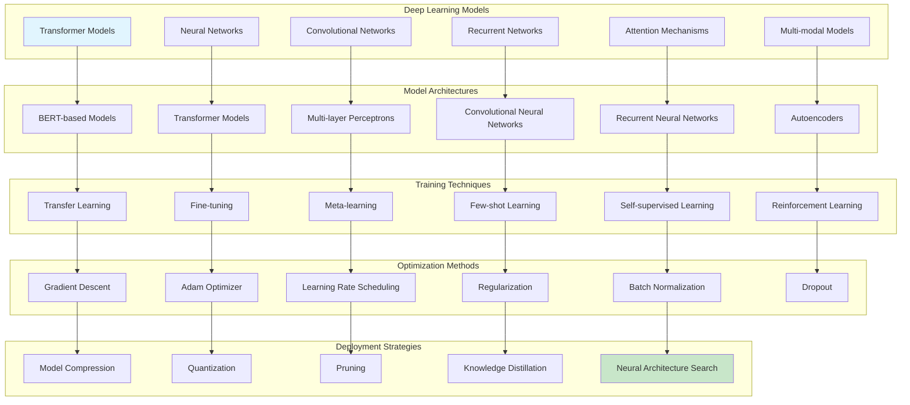

### Reinforcement Learning Integration

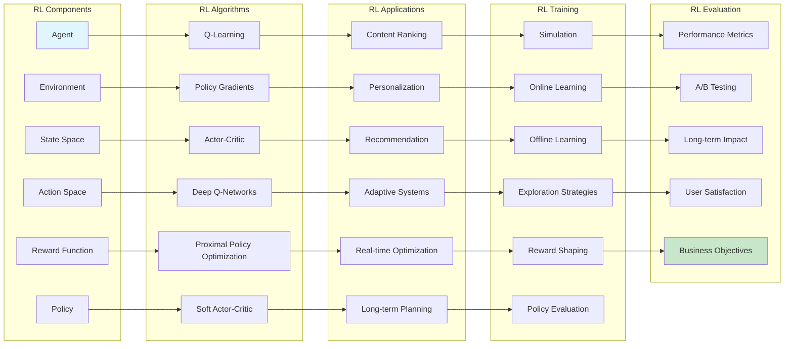

### Multi-modal Learning Integration

```mermaid
graph TD
    subgraph "Multi-modal Data Sources"
        A[Text Content]
        B[Image Content]
        C[Video Content]
        D[Audio Content]
        E[Graph Data]
        F[Temporal Data]
    end

    subgraph "Multi-modal Models"
        G[Multi-modal Transformers]
        H[Cross-modal Attention]
        I[Fusion Networks]
        J[Modality-specific Encoders]
        K[Shared Representations]
        L[Modality Alignment]
    end

    subgraph "Multi-modal Processing"
        M[Modality Extraction]
        N[Feature Alignment]
        O[Cross-modal Learning]
        P[Fusion Strategies]
        Q[Representation Learning]
        R[Transfer Learning]
    end

    subgraph "Multi-modal Applications"
        S[Content Understanding]
        T[Context Awareness]
        U[Rich Representations]
                V[Improved Relevance]
        W[Better Personalization]
        X[Enhanced User Experience]
    end

    subgraph "Multi-modal Challenges"
        Y[Data Alignment]
        Z[Modality Gap]
        AA[Computational Complexity]
        AB[Scalability]
        AC[Real-time Processing]
    end

    A --> G
    B --> H
    C --> I
    D --> J
    E --> K
    F --> L

    G --> M
    H --> N
    I --> O
    J --> P
    K --> Q
    L --> R

    M --> S
    N --> T
    O --> U
    P --> V
    Q --> W
    R --> X

    S --> Y
    T --> Z
    U --> AA
    V --> AB
    W --> AC

    style A fill:#e1f5fe
    style AC fill:#c8e6c9
```

This documentation provides a comprehensive overview of the machine learning integration in Twitter Home Mixer, covering everything from basic model architecture to advanced techniques like reinforcement learning and multi-modal learning.