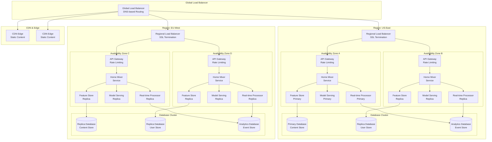
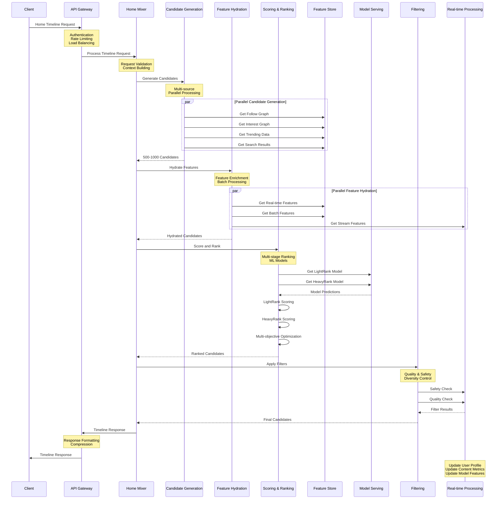
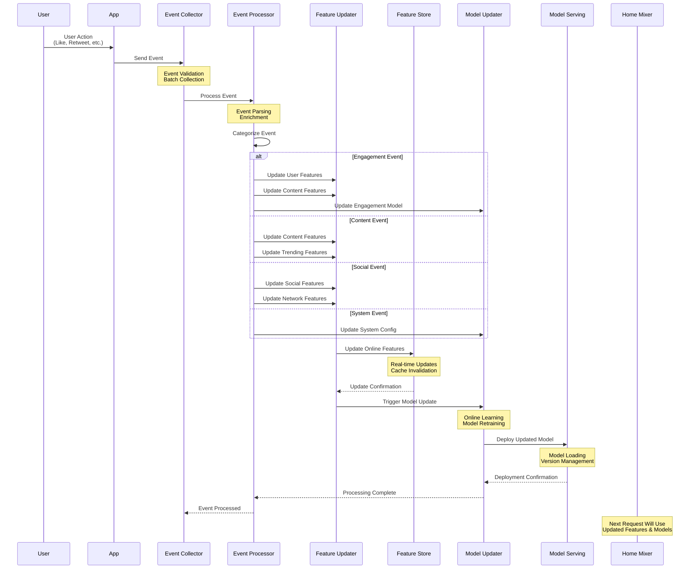
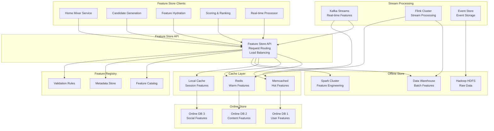
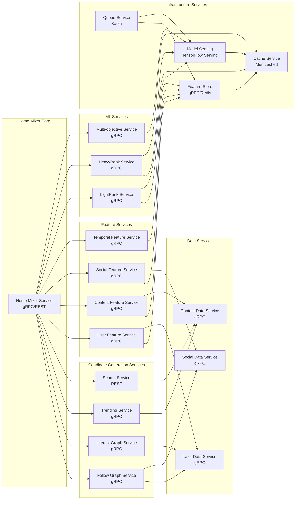
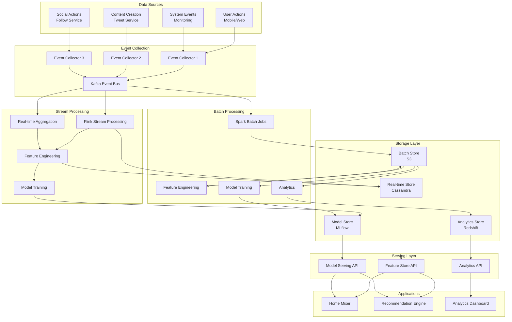
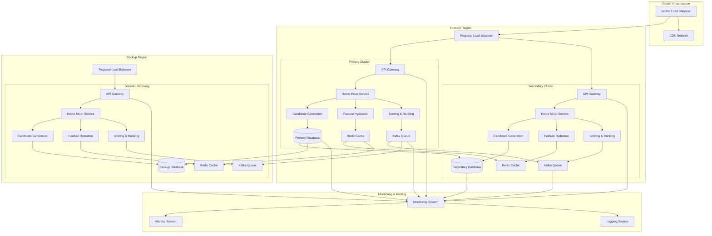
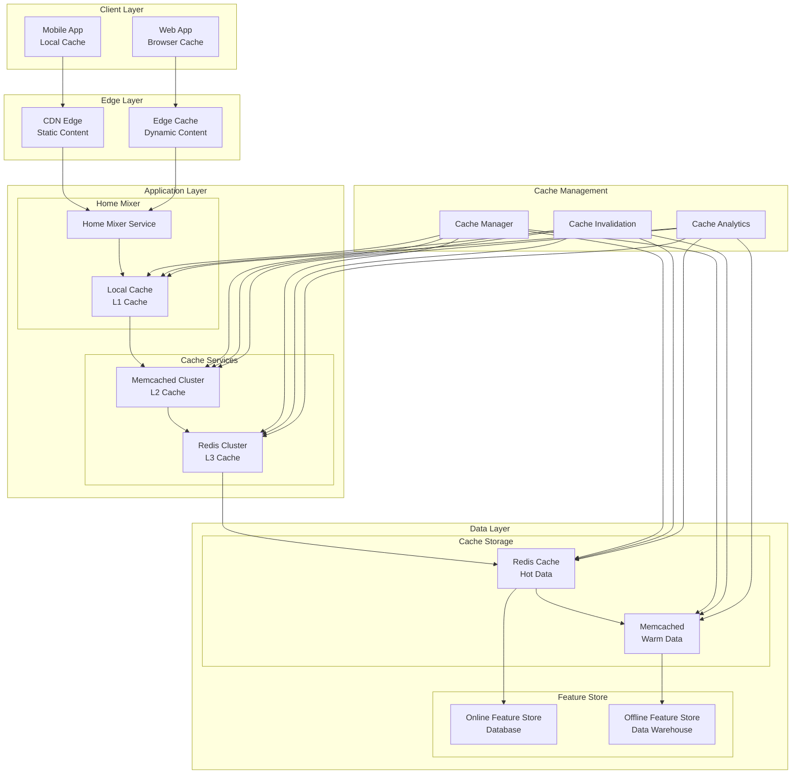
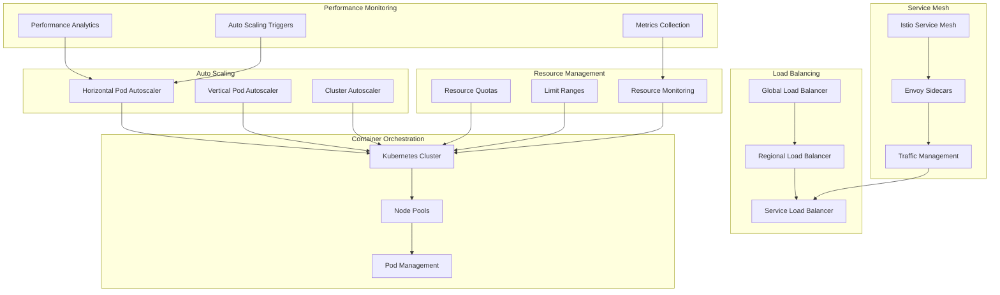

# Twitter Home Mixer - Architecture Diagrams

## Overview

This document contains detailed architecture diagrams for the Twitter Home Mixer system, illustrating component relationships, data flows, and deployment patterns.

---

## 1. High-Level System Architecture

### 1.1 Complete System Overview

```mermaid
graph TB
    subgraph "Client Layer"
        C1[Mobile App]
        C2[Web App]
        C3[Third-party Apps]
    end

    subgraph "API Gateway"
        AG[API Gateway<br/>Rate Limiting<br/>Authentication<br/>Load Balancing]
    end

    subgraph "Home Mixer Service"
        HM[Home Mixer Service<br/>Pipeline Orchestration]

        subgraph "Candidate Generation"
            CG1[Follow Graph<br/>Generator]
            CG2[Interest Graph<br/>Generator]
            CG3[Trending<br/>Generator]
            CG4[Search<br/>Generator]
            CG5[Recommended<br/>Generator]
        end

        subgraph "Feature Hydration"
            FH1[User Features<br/>Hydrator]
            FH2[Content Features<br/>Hydrator]
            FH3[Social Features<br/>Hydrator]
            FH4[Temporal Features<br/>Hydrator]
        end

        subgraph "Scoring & Ranking"
            SR1[LightRank<br/>Scorer]
            SR2[HeavyRank<br/>Scorer]
            SR3[Multi-objective<br/>Optimizer]
            SR4[Ranking<br/>Adjuster]
        end

        subgraph "Filtering"
            F1[Quality Filter]
            F2[Safety Filter]
            F3[Diversity Filter]
            F4[Freshness Filter]
        end
    end

    subgraph "Support Services"
        subgraph "Feature Store"
            FS1[Online Feature Store]
            FS2[Offline Feature Store]
            FS3[Feature Cache]
        end

        subgraph "Model Serving"
            MS1[Model Registry]
            MS2[Prediction Service]
            MS3[Model Monitoring]
        end

        subgraph "Real-time Processing"
            RP1[Event Processor]
            RP2[Feature Updater]
            RP3[Model Updater]
        end

        subgraph "User Context"
            UC1[User Profile<br/>Service]
            UC2[Session<br/>Manager]
            UC3[Preference<br/>Manager]
        end
    end

    subgraph "Data Layer"
        subgraph "Content Data"
            CD1[Content Store]
            CD2[Media Store]
            CD3[Index Store]
        end

        subgraph "User Data"
            UD1[User Profile DB]
            UD2[Activity Store]
            UD3[Preference Store]
        end

        subgraph "Social Data"
            SD1[Social Graph DB]
            SD2[Relationship Store]
            SD3[Network Analytics]
        end

        subgraph "Event Data"
            ED1[Event Stream]
            ED2[Event Store]
            ED3[Analytics Store]
        end
    end

    subgraph "External Services"
        ES1[Content Moderation]
        ES2[Trending Service]
        ES3[Search Service]
        ES4[Analytics Service]
    end

    %% Client connections
    C1 --> AG
    C2 --> AG
    C3 --> AG

    %% API Gateway to Home Mixer
    AG --> HM

    %% Home Mixer internal connections
    HM --> CG1
    HM --> CG2
    HM --> CG3
    HM --> CG4
    HM --> CG5

    CG1 --> FH1
    CG2 --> FH2
    CG3 --> FH3
    CG4 --> FH4

    FH1 --> SR1
    FH2 --> SR1
    FH3 --> SR2
    FH4 --> SR2

    SR1 --> SR3
    SR2 --> SR3
    SR3 --> SR4

    SR4 --> F1
    SR4 --> F2
    SR4 --> F3
    SR4 --> F4

    %% Support services connections
    CG1 --> FS1
    CG2 --> FS2
    CG3 --> FS3
    FH1 --> FS1
    FH2 --> FS2
    FH3 --> FS3

    SR1 --> MS1
    SR2 --> MS2
    SR3 --> MS3

    HM --> RP1
    RP1 --> RP2
    RP1 --> RP3

    HM --> UC1
    HM --> UC2
    HM --> UC3

    %% Data layer connections
    CG1 --> SD1
    CG2 --> UD1
    CG3 --> CD1
    CG4 --> CD1

    FH1 --> UD1
    FH2 --> CD1
    FH3 --> SD1

    RP1 --> ED1
    RP2 --> FS1
    RP3 --> MS1

    UC1 --> UD1
    UC2 --> UD2
    UC3 --> UD3

    %% External services connections
    F2 --> ES1
    CG3 --> ES2
    CG4 --> ES3
    HM --> ES4
```

### 1.2 Deployment Architecture

---

## 2. Data Flow Diagrams

### 2.1 Request Processing Pipeline

### 2.2 Real-time Event Processing

### 2.3 Feature Store Architecture

---

## 3. Component Interaction Diagrams

### 3.1 Microservice Communication

### 3.2 Data Pipeline Architecture

### 3.3 High Availability Architecture

---

## 4. Performance Optimization Architecture

### 4.1 Caching Strategy

### 4.2 Scalability Architecture

---

## Conclusion

These architecture diagrams provide a comprehensive view of the Twitter Home Mixer system, illustrating:

1. **System Architecture**: High-level overview of all components and their relationships
2. **Data Flow**: How data moves through the system from request to response
3. **Component Interactions**: How services communicate and coordinate
4. **Deployment Patterns**: How the system is deployed across regions and availability zones
5. **Performance Optimization**: Caching, scaling, and monitoring strategies

The architecture is designed to be:
- **Scalable**: Horizontally scalable to handle millions of requests
- **Resilient**: Fault-tolerant with multiple levels of redundancy
- **Performant**: Low-latency with optimized data flows
- **Maintainable**: Modular design with clear separation of concerns
- **Monitorable**: Comprehensive monitoring and observability

These diagrams serve as a reference for understanding the system architecture and guiding implementation and operational decisions.