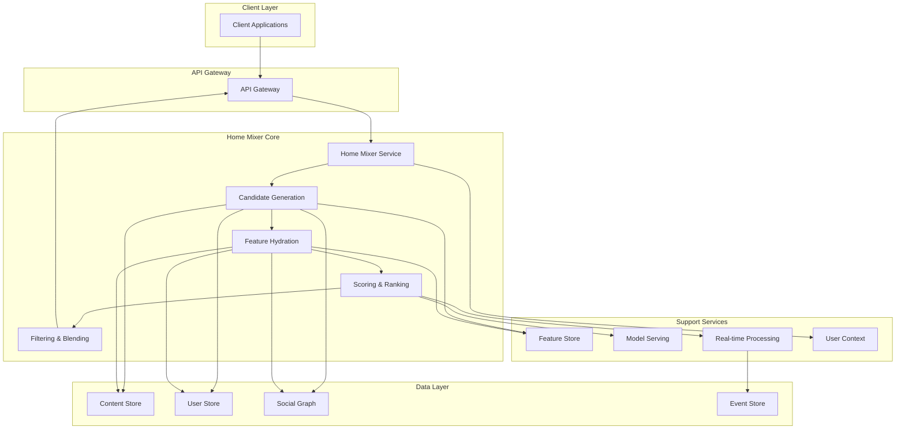
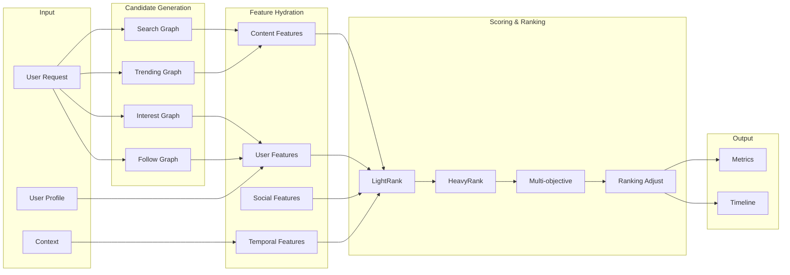
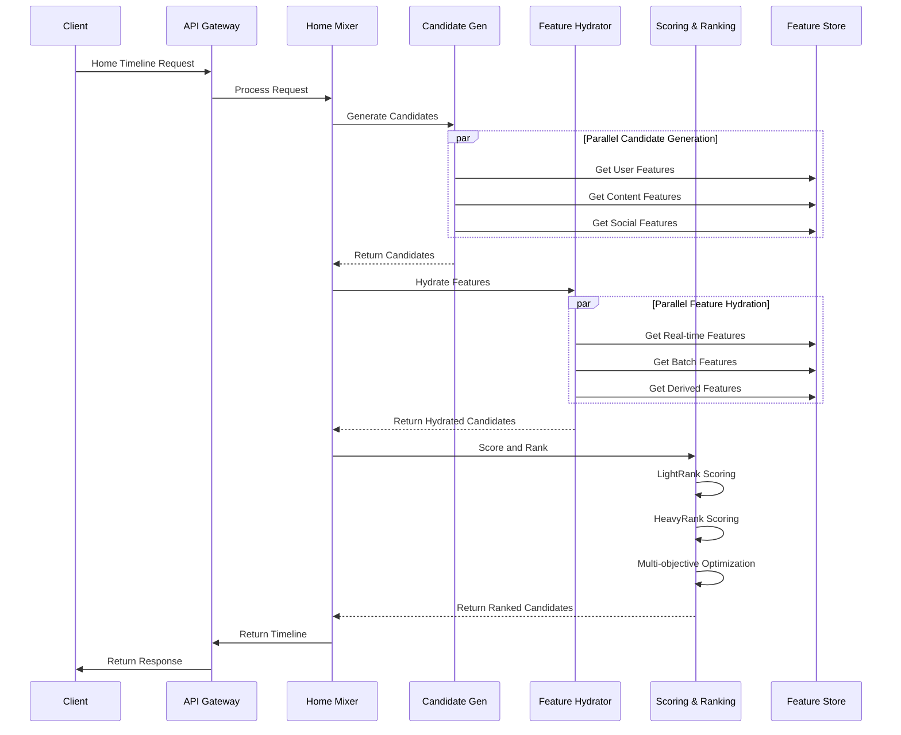

# Twitter Home Mixer Algorithm - Technical Specification Library

## Document Overview

This specification library provides a comprehensive technical breakdown of the Twitter Home Mixer algorithm, detailing its architecture, components, data flows, and implementation patterns.

### Revision History
- v1.0.0 - Initial specification creation
- Author: Twitter Home Mixer Architecture Team

## Table of Contents

1. [System Architecture Overview](#1-system-architecture-overview)
2. [Core Components and Modules](#2-core-components-and-modules)
3. [Data Flow and Processing Pipelines](#3-data-flow-and-processing-pipelines)
4. [Scoring and Ranking Mechanisms](#4-scoring-and-ranking-mechanisms)
5. [Candidate Generation and Filtering](#5-candidate-generation-and-filtering)
6. [Feature Hydration Systems](#6-feature-hydration-systems)
7. [Real-time Processing Capabilities](#7-real-time-processing-capabilities)
8. [Machine Learning Integration](#8-machine-learning-integration)
9. [Performance Optimization Features](#9-performance-optimization-features)
10. [Component Interaction Diagrams](#10-component-interaction-diagrams)

---

## 1. System Architecture Overview

### 1.1 High-Level Architecture

The Twitter Home Mixer operates as a multi-stage pipeline system designed to deliver personalized, engaging content to users in real-time. The architecture follows a microservices-based approach with specialized components handling different aspects of the content recommendation process.

### 1.2 Design Principles

- **Low Latency**: Sub-200ms end-to-end processing time
- **High Throughput**: Support for millions of requests per second
- **Personalization**: User-specific content recommendations
- **Freshness**: Real-time content inclusion
- **Scalability**: Horizontal scaling capabilities
- **Fault Tolerance**: Graceful degradation and fallback mechanisms

### 1.3 System Boundaries

```
┌─────────────────────────────────────────────────────────────────┐
│                     Twitter Home Mixer System                     │
├─────────────────────────────────────────────────────────────────┤
│  ┌─────────────────┐  ┌─────────────────┐  ┌─────────────────┐  │
│  │   Candidate    │  │   Feature       │  │   Scoring &     │  │
│  │   Generation   │──│   Hydration    │──│   Ranking       │  │
│  │   Services     │  │   Services     │  │   Services      │  │
│  └─────────────────┘  └─────────────────┘  └─────────────────┘  │
│           │                     │                     │         │
│  ┌─────────────────┐  ┌─────────────────┐  ┌─────────────────┐  │
│  │   Real-time     │  │   Machine       │  │   Content       │  │
│  │   Processing    │  │   Learning      │  │   Filtering     │  │
│  │   Services     │  │   Services     │  │   Services      │  │
│  └─────────────────┘  └─────────────────┘  └─────────────────┘  │
└─────────────────────────────────────────────────────────────────┘
```

---

## 2. Core Components and Modules

### 2.1 Candidate Generation Module

**Purpose**: Identify and retrieve potential content candidates for recommendation

**Key Components**:
- **Follow Graph Service**: Manages user relationships and network connections
- **Interest Graph Service**: Tracks user interests and topic preferences
- **Content Repository**: Stores and indexes available content
- **Trending Service**: Identifies trending content and topics
- **Search Service**: Provides content discovery capabilities

**Technical Implementation**:
```scala
trait CandidateGenerator {
  def generateCandidates(userId: UserId, context: RequestContext): Future[Seq[Candidate]]
  def getGeneratorName(): String
  def isEligible(userId: UserId): Boolean
}

class FollowGraphCandidateGenerator extends CandidateGenerator {
  // Implementation for follow-based candidate generation
}

class InterestGraphCandidateGenerator extends CandidateGenerator {
  // Implementation for interest-based candidate generation
}
```

### 2.2 Feature Hydration Module

**Purpose**: Enrich candidates with relevant features for scoring and ranking

**Key Components**:
- **Real-time Feature Store**: Low-latency feature retrieval
- **Batch Feature Store**: Pre-computed features from offline processing
- **Social Context Feature Generator**: User relationship features
- **Content Feature Generator**: Content-based features
- **Temporal Feature Generator**: Time-based features

**Technical Implementation**:
```scala
trait FeatureHydrator {
  def hydrate(candidates: Seq[Candidate], context: RequestContext): Future[Seq[HydratedCandidate]]
  def getFeatureNames(): Seq[String]
}

class SocialFeatureHydrator extends FeatureHydrator {
  // Implementation for social feature extraction
}

class ContentFeatureHydrator extends FeatureHydrator {
  // Implementation for content feature extraction
}
```

### 2.3 Scoring and Ranking Module

**Purpose**: Evaluate and rank candidates based on multiple signals

**Key Components**:
- **LightRank Service**: Lightweight ranking for initial filtering
- **HeavyRank Service**: Comprehensive ranking for final selection
- **Multi-objective Optimizer**: Balances multiple ranking objectives
- **Diversity Controller**: Ensures content diversity
- **Freshness Booster**: Prioritizes recent content

**Technical Implementation**:
```scala
trait Scorer {
  def score(candidates: Seq[HydratedCandidate], context: RequestContext): Future[Seq[ScoredCandidate]]
  def getScorerName(): String
}

class LightRankScorer extends Scorer {
  // Lightweight scoring implementation
}

class HeavyRankScorer extends Scorer {
  // Comprehensive scoring implementation
}
```

### 2.4 Real-time Processing Module

**Purpose**: Handle real-time events and updates

**Key Components**:
- **Event Processor**: Ingests and processes real-time events
- **User Activity Tracker**: Tracks user engagement patterns
- **Content Freshness Monitor**: Monitors content recency
- **Real-time Feature Updater**: Updates features in real-time

**Technical Implementation**:
```scala
class RealtimeProcessor {
  def processEvent(event: UserEvent): Future[Unit]
  def updateUserProfile(userId: UserId, activity: UserActivity): Future[Unit]
  def updateContentMetrics(contentId: ContentId, metrics: ContentMetrics): Future[Unit]
}
```

---

## 3. Data Flow and Processing Pipelines

### 3.1 Overall Pipeline Architecture

```
User Request → Candidate Generation → Feature Hydration → Scoring → Ranking → Filtering → Response
     │                │                  │            │         │          │
     │                │                  │            │         │          └── Quality Control
     │                │                  │            │         └── Diversity Control
     │                │                  │            └── Multi-objective Ranking
     │                │                  └── Feature Enrichment
     │                └── Multi-source Candidate Retrieval
     └── Request Context and User Profile
```

### 3.2 Candidate Generation Pipeline

**Flow**:
1. **Request Reception**: Receive home timeline request
2. **Context Building**: Build user context and preferences
3. **Parallel Generation**: Multiple generators work in parallel
4. **Candidate Deduplication**: Remove duplicate candidates
5. **Initial Filtering**: Apply basic quality filters

**Technical Details**:
- **Parallel Execution**: Multiple candidate generators run concurrently
- **Timeout Handling**: Each generator has strict timeout (50-100ms)
- **Fallback Mechanisms**: Graceful degradation if generators fail
- **Candidate Pool Management**: Maintain optimal candidate pool size

### 3.3 Feature Hydration Pipeline

**Flow**:
1. **Feature Identification**: Determine required features for candidates
2. **Parallel Hydration**: Multiple hydrators work in parallel
3. **Feature Validation**: Ensure feature quality and completeness
4. **Feature Aggregation**: Combine features from multiple sources
5. **Feature Normalization**: Normalize features for scoring

**Technical Details**:
- **Batch Processing**: Process candidates in batches for efficiency
- **Caching Strategies**: Implement multi-level caching
- **Feature Dependencies**: Handle feature dependencies and ordering
- **Error Handling**: Graceful handling of missing features

### 3.4 Scoring and Ranking Pipeline

**Flow**:
1. **LightRank Scoring**: Initial lightweight scoring
2. **Candidate Pruning**: Remove low-scoring candidates
3. **HeavyRank Scoring**: Comprehensive scoring of remaining candidates
4. **Multi-objective Optimization**: Balance engagement, diversity, freshness
5. **Final Ranking**: Apply ranking adjustments and filters

**Technical Details**:
- **Two-stage Ranking**: LightRank for initial filtering, HeavyRank for final ranking
- **Model Ensemble**: Combine multiple scoring models
- **Real-time Adjustments**: Apply real-time signals and adjustments
- **Diversity Enforcement**: Ensure content diversity in final ranking

---

## 4. Scoring and Ranking Mechanisms

### 4.1 Scoring Model Architecture

**Model Types**:
- **LightRank Models**: Logistic regression, gradient boosting
- **HeavyRank Models**: Deep neural networks, transformer-based models
- **Real-time Models**: Online learning models for immediate feedback

**Feature Categories**:
- **User Features**: Demographics, interests, behavior patterns
- **Content Features**: Text, media, engagement metrics
- **Social Features**: Relationship strength, network position
- **Temporal Features**: Recency, time-of-day patterns
- **Context Features**: Device, location, session context

### 4.2 LightRank Scoring

**Purpose**: Fast initial scoring for candidate filtering

**Characteristics**:
- **Low Complexity**: Simple models for fast inference
- **High Throughput**: Process thousands of candidates per second
- **Memory Efficiency**: Small model footprint
- **Real-time Features**: Incorporate real-time signals

**Implementation**:
```scala
class LightRankScorer extends Scorer {
  private val model: LogisticRegressionModel = loadModel("lightrank_v2")

  def score(candidates: Seq[HydratedCandidate], context: RequestContext): Future[Seq[ScoredCandidate]] = {
    Future {
      candidates.map { candidate =>
        val features = extractLightRankFeatures(candidate, context)
        val score = model.predict(features)
        ScoredCandidate(candidate, score, "LightRank")
      }
    }
  }
}
```

### 4.3 HeavyRank Scoring

**Purpose**: Comprehensive scoring for final ranking decisions

**Characteristics**:
- **High Complexity**: Deep neural networks with attention mechanisms
- **Rich Features**: Incorporate extensive feature sets
- **Multi-objective**: Balance multiple ranking objectives
- **Context Awareness**: Consider user context and session state

**Implementation**:
```scala
class HeavyRankScorer extends Scorer {
  private val model: DeepRankingModel = loadModel("heavyrank_v3")

  def score(candidates: Seq[HydratedCandidate], context: RequestContext): Future[Seq[ScoredCandidate]] = {
    Future {
      candidates.map { candidate =>
        val features = extractHeavyRankFeatures(candidate, context)
        val embeddings = generateEmbeddings(candidate, context)
        val score = model.predict(features, embeddings)
        ScoredCandidate(candidate, score, "HeavyRank")
      }
    }
  }
}
```

### 4.4 Multi-objective Optimization

**Objectives**:
- **Engagement**: Maximize user engagement (likes, retweets, replies)
- **Diversity**: Ensure content diversity in timeline
- **Freshness**: Prioritize recent and trending content
- **Relevance**: Match user interests and preferences
- **Safety**: Filter harmful or inappropriate content

**Optimization Strategies**:
- **Weighted Sum**: Combine objectives with learned weights
- **Pareto Optimization**: Find optimal trade-offs between objectives
- **Constraint Satisfaction**: Ensure constraints are met
- **Real-time Adjustment**: Adjust weights based on user feedback

### 4.5 Ranking Adjustments

**Types of Adjustments**:
- **Diversity Boosting**: Increase visibility of underrepresented content
- **Freshness Boosting**: Prioritize recent content
- **Quality Filtering**: Remove low-quality content
- **Safety Filtering**: Remove harmful content
- **Personalization**: Adjust based on user preferences

**Implementation**:
```scala
class RankingAdjuster {
  def adjustRanking(candidates: Seq[ScoredCandidate], context: RequestContext): Seq[ScoredCandidate] = {
    candidates
      .map(applyDiversityBoost)
      .map(applyFreshnessBoost)
      .filter(applyQualityFilter)
      .filter(applySafetyFilter)
      .sortBy(_.score)(Ordering[Double].reverse)
  }
}
```

---

## 5. Candidate Generation and Filtering

### 5.1 Candidate Sources

**Primary Sources**:
- **Follow Network**: Content from followed accounts
- **Interest Graph**: Content matching user interests
- **Trending Topics**: Popular and trending content
- **Search Discovery**: Content from user search activity
- **Social Proofs**: Content engaged by similar users

**Secondary Sources**:
- **Recommended Accounts**: Content from recommended accounts
- **Topic-based**: Content from relevant topics
- **Location-based**: Local content and trends
- **Event-based**: Content from events and moments

### 5.2 Generation Strategies

**Follow-based Generation**:
- **Direct Follows**: Content from directly followed accounts
- **Second-degree**: Content from follows of follows
- **Network Proximity**: Content from socially proximate accounts

**Interest-based Generation**:
- **Topic Modeling**: Content matching user interest topics
- **Content Similarity**: Similar to previously engaged content
- **Collaborative Filtering**: Content liked by similar users

**Trending Generation**:
- **Trending Topics**: Content from trending topics
- **Viral Content**: Rapidly spreading content
- **Breaking News**: Time-sensitive breaking content

### 5.3 Filtering Mechanisms

**Quality Filters**:
- **Content Quality**: Remove low-quality or spam content
- **Engagement Quality**: Filter based on engagement patterns
- **Source Quality**: Evaluate source credibility
- **Freshness**: Remove outdated content

**Safety Filters**:
- **Content Safety**: Remove harmful or inappropriate content
- **User Safety**: Filter based on user safety settings
- **Sensitive Content**: Handle sensitive content according to preferences
- **Community Guidelines**: Enforce community guidelines

**Personalization Filters**:
- **Interest Matching**: Filter based on user interests
- **Behavioral Filters**: Based on user behavior patterns
- **Preference Filters**: Respect user preferences and settings
- **Context Filters**: Consider current context and session

### 5.4 Candidate Management

**Pool Management**:
- **Initial Pool Size**: 500-1000 candidates
- **Pruning Strategy**: Remove low-quality candidates early
- **Diversity Maintenance**: Ensure diverse candidate pool
- **Representation Balance**: Balance different content types

**Optimization Strategies**:
- **Parallel Generation**: Generate candidates from multiple sources in parallel
- **Incremental Filtering**: Apply filters incrementally to reduce computation
- **Early Termination**: Stop generation when sufficient candidates are found
- **Resource Management**: Optimize resource usage during generation

---

## 6. Feature Hydration Systems

### 6.1 Feature Store Architecture

**Feature Categories**:
- **Real-time Features**: Computed on-demand
- **Batch Features**: Pre-computed offline
- **Stream Features**: Computed from event streams
- **Derived Features**: Computed from other features

**Feature Store Types**:
- **Online Feature Store**: Low-latency feature retrieval
- **Offline Feature Store**: Batch feature computation and storage
- **Streaming Feature Store**: Real-time feature computation
- **Feature Registry**: Feature metadata and management

### 6.2 Feature Hydration Process

**Hydration Pipeline**:
1. **Feature Identification**: Determine required features for candidates
2. **Feature Retrieval**: Retrieve features from appropriate stores
3. **Feature Computation**: Compute derived features
4. **Feature Validation**: Ensure feature quality and completeness
5. **Feature Aggregation**: Combine features from multiple sources

**Optimization Techniques**:
- **Batch Retrieval**: Retrieve features in batches for efficiency
- **Pre-computation**: Pre-compute expensive features
- **Caching**: Implement multi-level caching strategies
- **Lazy Loading**: Load features only when needed

### 6.3 Feature Types and Sources

**User Features**:
- **Demographic Features**: Age, gender, location
- **Interest Features**: Topics, categories, preferences
- **Behavioral Features**: Activity patterns, engagement history
- **Social Features**: Network characteristics, influence

**Content Features**:
- **Text Features**: NLP-derived features, embeddings
- **Media Features**: Image/video analysis results
- **Engagement Features**: Likes, retweets, replies
- **Temporal Features**: Creation time, recency

**Social Context Features**:
- **Relationship Features**: Follow status, interaction history
- **Network Features**: Common connections, network proximity
- **Influence Features**: Author influence, engagement patterns
- **Similarity Features**: User-content similarity scores

### 6.4 Feature Engineering

**Feature Transformation**:
- **Normalization**: Scale features to standard ranges
- **Encoding**: Convert categorical features to numerical
- **Embeddings**: Generate dense vector representations
- **Aggregation**: Combine multiple features into composite features

**Feature Selection**:
- **Importance Scoring**: Rank features by importance
- **Correlation Analysis**: Remove highly correlated features
- **Dimensionality Reduction**: Apply PCA or other reduction techniques
- **Domain Knowledge**: Incorporate domain expertise

**Feature Validation**:
- **Quality Checks**: Validate feature quality and completeness
- **Consistency Checks**: Ensure temporal consistency
- **Outlier Detection**: Identify and handle outliers
- **Missing Value Handling**: Strategies for missing features

---

## 7. Real-time Processing Capabilities

### 7.1 Real-time Event Processing

**Event Types**:
- **User Engagement Events**: Likes, retweets, replies, clicks
- **Content Events**: Tweet creation, deletion, updates
- **Social Events**: Follows, unfollows, blocks
- **System Events**: Model updates, configuration changes

**Processing Architecture**:
- **Event Ingestion**: Kafka-based event streaming
- **Stream Processing**: Apache Flink for real-time processing
- **State Management**: In-memory state with persistence
- **Backpressure Handling**: Manage event throughput

### 7.2 Real-time Feature Updates

**Update Mechanisms**:
- **Incremental Updates**: Update features incrementally
- **Batch Updates**: Periodic batch updates
- **On-demand Updates**: Compute features on request
- **Hybrid Updates**: Combination of update strategies

**Update Frequency**:
- **High Frequency**: Updates every few seconds (engagement metrics)
- **Medium Frequency**: Updates every few minutes (trending scores)
- **Low Frequency**: Updates hourly or daily (user preferences)

### 7.3 Real-time Model Updates

**Online Learning**:
- **Model Updates**: Incremental model updates
- **Feature Adaptation**: Adapt to changing feature distributions
- **Concept Drift Handling**: Detect and handle concept drift
- **Feedback Integration**: Incorporate user feedback

**A/B Testing**:
- **Real-time Experiments**: Run A/B tests in real-time
- **Performance Monitoring**: Monitor model performance
- **Automated Rollback**: Roll back underperforming models
- **Canary Deployments**: Gradual model deployment

### 7.4 Real-time Personalization

**Personalization Strategies**:
- **Session-based**: Adapt to current session context
- **Behavior-based**: Update based on recent behavior
- **Context-aware**: Consider current context and environment
- **Multi-objective**: Balance multiple personalization objectives

**Adaptation Mechanisms**:
- **Short-term Adaptation**: Quick adaptation to user actions
- **Long-term Learning**: Long-term preference learning
- **Context Switching**: Adapt to different contexts
- **Feedback Integration**: Incorporate explicit and implicit feedback

---

## 8. Machine Learning Integration

### 8.1 ML Model Architecture

**Model Types**:
- **Classification Models**: Binary and multi-class classification
- **Regression Models**: Continuous value prediction
- **Ranking Models**: Learning to rank algorithms
- **Embedding Models**: Dense vector representations

**Model Frameworks**:
- **TensorFlow**: Deep learning models
- **PyTorch**: Research and prototyping
- **XGBoost**: Gradient boosting models
- **Scikit-learn**: Traditional ML models

### 8.2 Training Pipeline

**Training Data Sources**:
- **User Engagement Data**: Historical engagement patterns
- **Content Features**: Content metadata and features
- **Social Context**: User relationships and network
- **Temporal Features**: Time-based patterns

**Training Process**:
1. **Data Collection**: Gather training data from multiple sources
2. **Feature Engineering**: Create and transform features
3. **Model Training**: Train models with appropriate algorithms
4. **Model Evaluation**: Evaluate model performance
5. **Model Deployment**: Deploy models to production

### 8.3 Model Serving

**Serving Architecture**:
- **Model Registry**: Centralized model management
- **Model Loading**: Efficient model loading and caching
- **Prediction Service**: Low-latency prediction serving
- **Model Monitoring**: Monitor model performance and health

**Serving Strategies**:
- **Batch Serving**: Process predictions in batches
- **Online Serving**: Real-time prediction serving
- **Hybrid Serving**: Combination of batch and online serving
- **Edge Serving**: Deploy models closer to users

### 8.4 Model Monitoring and Maintenance

**Performance Monitoring**:
- **Accuracy Metrics**: Track model accuracy over time
- **Latency Metrics**: Monitor prediction latency
- **Resource Usage**: Monitor CPU, memory, and network usage
- **Error Rates**: Track prediction errors and failures

**Model Maintenance**:
- **Regular Retraining**: Periodic model retraining
- **Concept Drift Detection**: Detect and handle concept drift
- **Model Validation**: Validate model performance before deployment
- **Rollback Mechanisms**: Roll back to previous model versions

---

## 9. Performance Optimization Features

### 9.1 Latency Optimization

**Optimization Strategies**:
- **Parallel Processing**: Execute tasks in parallel
- **Caching**: Implement multi-level caching
- **Lazy Loading**: Load resources only when needed
- **Batch Processing**: Process items in batches

**Latency Targets**:
- **End-to-end Latency**: < 200ms
- **Candidate Generation**: < 50ms
- **Feature Hydration**: < 80ms
- **Scoring and Ranking**: < 100ms

### 9.2 Throughput Optimization

**Scalability Features**:
- **Horizontal Scaling**: Scale horizontally with load
- **Load Balancing**: Distribute load across instances
- **Resource Management**: Optimize resource usage
- **Queue Management**: Manage request queues efficiently

**Throughput Targets**:
- **Requests per Second**: > 1M QPS
- **Candidate Generation**: > 10K candidates/second
- **Feature Hydration**: > 5K candidates/second
- **Scoring and Ranking**: > 2K candidates/second

### 9.3 Memory Optimization

**Memory Management**:
- **Object Pooling**: Reuse objects to reduce GC overhead
- **Memory Caching**: Implement efficient memory caching
- **Garbage Collection**: Optimize GC settings
- **Memory Profiling**: Profile and optimize memory usage

**Optimization Techniques**:
- **Data Compression**: Compress data where possible
- **Efficient Data Structures**: Use memory-efficient data structures
- **Off-heap Storage**: Use off-heap storage for large objects
- **Memory Limits**: Set and enforce memory limits

### 9.4 Network Optimization

**Network Strategies**:
- **Connection Pooling**: Pool network connections
- **Data Compression**: Compress network data
- **Protocol Optimization**: Use efficient protocols
- **Caching**: Cache network responses

**Optimization Features**:
- **CDN Integration**: Use CDNs for static content
- **Edge Computing**: Deploy services closer to users
- **Load Balancing**: Distribute network load
- **Failover**: Implement network failover mechanisms

---

## 10. Component Interaction Diagrams

### 10.1 System Architecture Diagram



### 10.2 Data Flow Diagram



### 10.3 Service Interaction Diagram



---

## Conclusion

This technical specification library provides a comprehensive overview of the Twitter Home Mixer algorithm, detailing its architecture, components, data flows, and implementation patterns. The system is designed to deliver personalized, engaging content to users in real-time while maintaining high performance and scalability.

Key architectural principles include:
- **Modularity**: Clear separation of concerns with specialized components
- **Scalability**: Horizontal scaling capabilities to handle massive loads
- **Performance**: Low-latency processing with high throughput
- **Personalization**: Advanced ML models for content recommendation
- **Reliability**: Fault tolerance and graceful degradation

The Home Mixer continues to evolve with ongoing improvements in machine learning, real-time processing, and performance optimization to provide the best possible user experience.