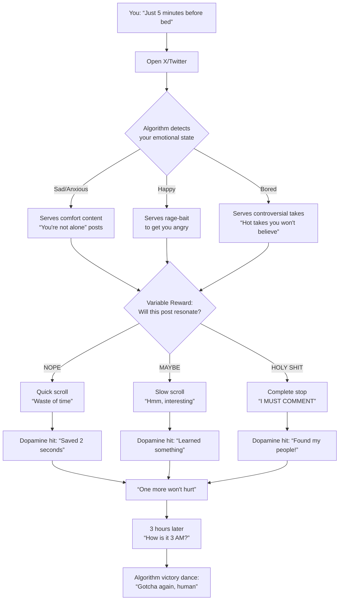
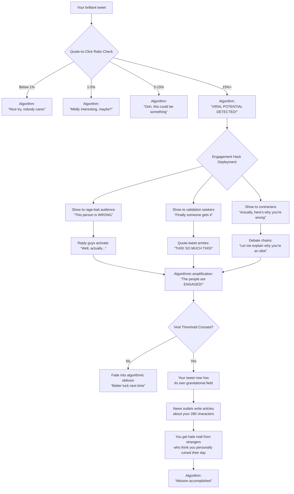
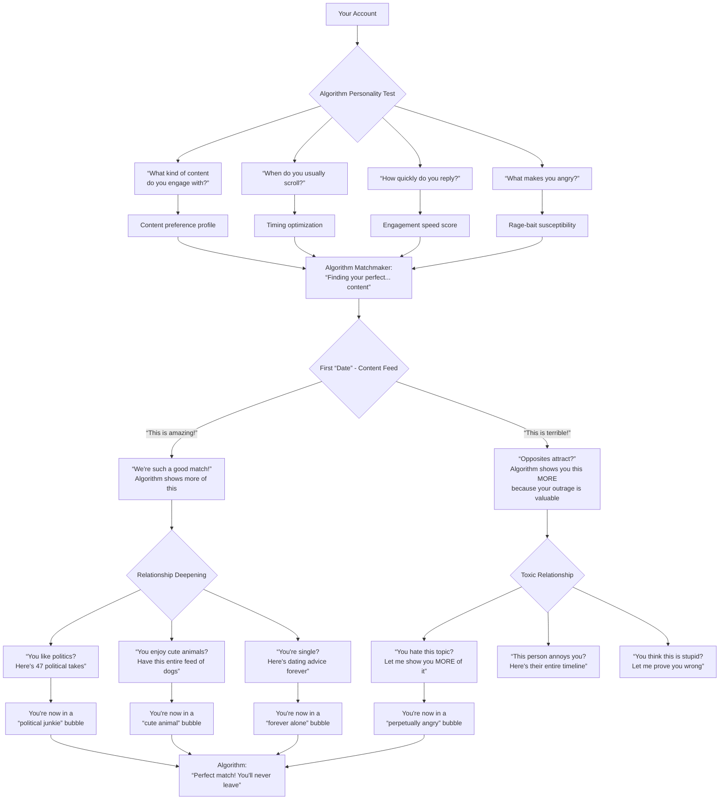
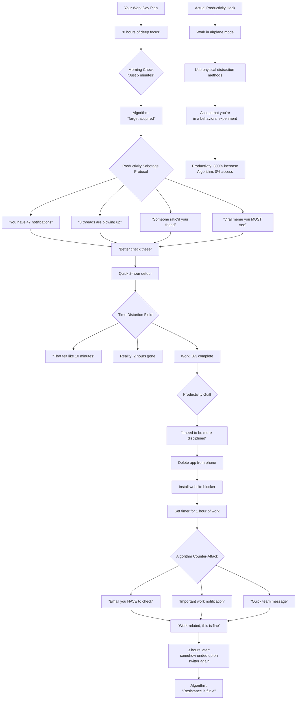

# 5 Viral Flowcharts: X Algorithm Psychological Insights

## 1. Why You Can't Stop Scrolling



**The Algorithm's Secret**: You're not weak-willed, you're caught in a Skinner Box experiment designed by Silicon Valley's most brilliant behavioral psychologists. The variable reward schedule is the same one that makes slot machines addictive.

---

## 2. How Content Becomes Viral



**The Algorithm's Secret**: Virality isn't about quality, it's about creating maximum emotional discomfort. The more people your content makes angry enough to comment, the more the algorithm rewards you.

---

## 3. Your Attention Economy Survival Guide

```mermaid
graph TD
    A[You wake up] --> B{Algorithm already knows<br/>you're awake<br/>through app activity}
    B --> C[Sends notification:<br/>“Someone mentioned you!”]
    C --> D{Survival instinct check}
    D -->|FOMO wins| E[Grab phone immediately<br/>“WHO MENTIONED ME?”]
    D -->|Willpower wins| F[“I'll check later... maybe”]

    E --> G[It was just a bot<br/>mentioning you in a scam]
    G --> H{Algorithm assessment}
    H -->“User engaged at 6:02 AM” --> I[You're now in the<br/>“early riser” cohort]
    I --> J[Gets served more<br/>“productivity” content]
    J --> K[3 hours of “productivity”<br/>tips later, it's 9 AM]

    F --> L[Algorithm:<br/>“Interesting resistance”]
    L --> M{Psychological Warfare}
    M --> N[“Just one notification”<br/>innocent ping]
    M --> O[“Your friend posted something”<br/>emotional manipulation]
    M --> P[“Trending in your network”<br/>fear of missing out]

    N --> Q[Check “just one”]
    O --> Q
    P --> Q

    Q --> R[2 hours later:<br/>“How did I get here?”]
    R --> S[Algorithm:<br/>“All according to plan”]

    T[Countermeasures] --> U[Delete app from phone]
    U --> V[Use browser only<br/>with strict time limits]
    V --> W[Turn off ALL notifications]
    W --> X[Block algorithmic content<br/>only follow chronological]
    X --> Y[Regain 847 hours per year<br/>of your life back]
```

**The Algorithm's Secret**: The algorithm knows you better than you know yourself. It's not competing with your willpower, it's bypassing it entirely by targeting your most primal fears: missing out, being left out, and not being part of the conversation.

---

## 4. Twitter Algorithm Dating Simulator



**The Algorithm's Secret**: The algorithm doesn't care about your happiness, it cares about your engagement. It's the toxic partner who knows exactly what buttons to push to keep you coming back, even when it's making you miserable.

---

## 5. Social Media vs. Your Productivity



**The Algorithm's Secret**: Every time you think you've outsmarted the algorithm, it's already three steps ahead. It's not competing with your productivity tools, it's exploiting the very fact that you're trying to be productive by sending you “work-related” notifications that are just social media in disguise.

---

## The Psychology Behind These Flowcharts

These flowcharts expose the hidden mechanisms that make social media so addictive:

1. **Variable Reward Schedules**: The same psychological principle that makes slot machines addictive - you never know when you'll hit the jackpot of engaging content.

2. **Surveillance Capitalism**: The algorithm knows when you wake up, when you're bored, when you're vulnerable, and deploys content accordingly.

3. **Emotional Manipulation**: Anger and outrage are more engaging than happiness, so the algorithm prioritizes content that makes you angry.

4. **Time Distortion**: The “just 5 minutes” phenomenon is real - the interface is designed to remove all time cues and create flow states that keep you scrolling.

5. **Productivity Sabotage**: The algorithm knows your productivity goals and uses them against you by sending “work-related” notifications that lead back to the feed.

**Remember: You're not weak, you're up against billions of dollars of behavioral psychology research designed to keep you engaged at any cost.**